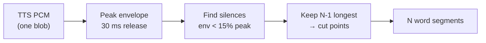
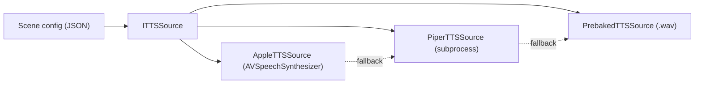
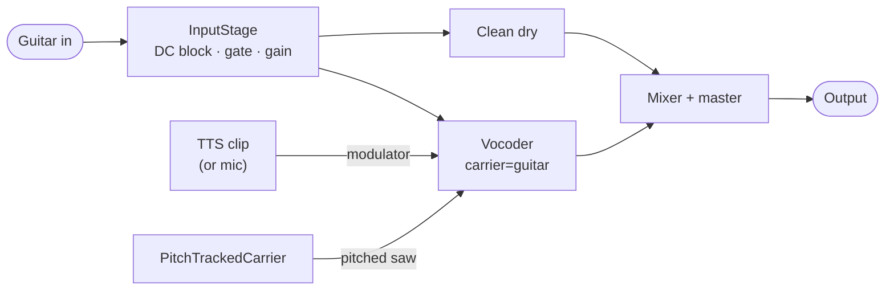

# While My Guitar Gently Speaks

<div class="flex gap-8 pt-12 items-center max-w-3xl mx-auto">

<div class="text-right w-full max-w-[457px]">
  <div class="text-4xl font-semibold">Todd Fisher</div>
  <div class="text-2xl opacity-75 pt-1">Head of Engineering · Philo Ventures</div>
  <div class="flex items-center justify-end gap-2 pt-3 text-lg opacity-80">
    <span>todd-b-fisher</span>
    <svg viewBox="0 0 24 24" class="w-5 h-5" fill="#4DA8F0"><path d="M20.45 20.45h-3.56v-5.57c0-1.33-.02-3.04-1.85-3.04-1.86 0-2.14 1.45-2.14 2.94v5.67H9.35V9h3.41v1.56h.05c.48-.9 1.64-1.85 3.37-1.85 3.6 0 4.27 2.37 4.27 5.46v6.28zM5.34 7.43a2.06 2.06 0 1 1 0-4.13 2.06 2.06 0 0 1 0 4.13zM7.12 20.45H3.56V9h3.56v11.45zM22.22 0H1.77C.79 0 0 .77 0 1.73v20.54C0 23.23.79 24 1.77 24h20.45c.98 0 1.78-.77 1.78-1.73V1.73C24 .77 23.2 0 22.22 0z"/></svg>
  </div>
</div>

<div class="pl-5">

</div>
</div>

<div class="flex justify-center pt-12">
  
</div>

<!--
Hi, I'm Todd Fisher, Head of Engineering at Philo Ventures. For
the next ~30 minutes I'm going to walk you through a real-time
audio project — a guitar that talks and sings — and what shipping
it for the stage taught me about building with AI.
-->

---
layout: two-cols
class: gap-8
---

# Live performances rock

- **Slipknot's drummer** — flips upside-down mid-set
- **Blue Man Group** — silence as performance
- **The Sphere** — Las Vegas
- **Stranger Things: The First Shadow** — NYC

<div class="pt-8 opacity-75 text-sm">
We've all been blown away at some point.<br/>
Live shows connect us in a way recorded media can't.
</div>

<div class="pt-6 text-xl">
What's the next evolution — with AI?
</div>

::right::


<!--
Slipknot's drummer is on a rig that flips upside-down. Blue Man
Group turned percussion and silence into a brand. The Sphere is
its own visual category. Stranger Things in NYC is a full
theatrical experience. We've all been amazed at some point.
The question this talk is about: what does the next layer of
live performance look like, now that AI tools are in the kit?
-->

<div class="absolute bottom-4 left-6 text-xs opacity-30">1m</div>

---

# Setting the stage

- Great experiences stay with us forever.
- Creativity × technology yields surprising results
- A lot of interesting things are happening with AI right now
- The tools we have today are opening up new possibilities for **live performance**

<!--
This talk lives at the intersection of all three. I'm a software
engineer who plays guitar; I built a tool that uses TTS, LLMs,
real-time DSP, and a foot controller to make a guitar talk and
sing on stage. The interesting part isn't the AI — it's what live
performance lets you do with it.
-->


---

<div class="absolute inset-0 flex items-center justify-center p-6">
  
</div>

<!--
Walk the audience through the panels left → right:
1. Acoustic Scream — caveman with an acoustic. The starting point.
2. Electric Distortion — pickup + amp + dirt. The first big leap.
3. The Pedal Chain — fuzz, wah, delay; tone-shaping at the foot.
4. The Talkbox Voice — Peter Frampton, "Do You Feel Like We Do."
   First real "speaking" guitar. The mouth is the resonator.
5. Software Emulation — same effects, now in a plugin host.
6. AI Tools — synthesis + language generation. Where this talk lives.

Ebow gets a mention but isn't pictured; it's the side path.
-->

<div class="absolute bottom-4 left-6 text-xs opacity-30">1m</div>


---

<div class="absolute inset-0 flex items-center justify-center p-6">
  
</div>

<!--
Quick origin story. Every Halloween I had two choices: walk with
the kids or stay home. Found out you can crank a guitar amp loud
outside on Halloween and no one calls the cops. That's how this
whole thread started.
-->

---

<div class="absolute inset-0 flex items-center justify-center p-6">
  
</div>

---

<div class="absolute inset-0 flex items-center justify-center p-6">
  
</div>

<div class="absolute bottom-4 left-0 right-0 text-center text-sm opacity-80 z-10">
  <a
    href="https://www.activeviz.com/stranger-things-lights"
    target="_blank"
    rel="noopener noreferrer"
    class="hover:opacity-100"
  >
    activeviz.com/stranger-things-lights ↗
  </a>
</div>

<!--
One year I dressed as Eddie Munson from Stranger Things season 4.
Pause and read the room: "anyone here watch Stranger Things?"
That night, sitting on the porch in costume, I started asking:
what else could make this better?
-->

<div class="absolute bottom-4 left-6 text-xs opacity-30">3:30</div>


---

<div class="absolute inset-0 flex flex-col items-center justify-center text-center">
  <div class="text-5xl">What if my guitar could</div>
  <div class="text-9xl font-bold pt-6">speak?</div>
</div>

<!--
The pivot question. Pause after "speak" — let it land.
This is the setup for the demo.
-->

---
transition: fade-out
---

# Tools for the job

- **JUCE has the most production miles in live audio.** 
  "No allocations on the audio thread" is built into its idioms. C++ FTW!
- **Plugin formats are free.** AUv2, VST3, AAX — same source.
- **TTS** — Piper (local neural), Apple AVSpeechSynthesizer, prebaked WAV.
- **DSP** — 24-band channel vocoder, YIN pitch detection, PolyBLEP saw.

---
layout: center
---

# Goal: Guitar triggers saying a word

<div class="flex flex-col items-center gap-3 pt-6">

<div class="relative border border-gray-600 rounded-xl px-10 pt-7 pb-6">
  <div class="absolute -top-3 left-5 px-2 text-xs tracking-wide opacity-60 bg-black">Offline / bake this once</div>
  <div class="flex items-center gap-3">
    <div class="rounded-md px-5 py-3 font-medium" style="background:#e0f2fe;color:#0c4a6e">Raw text</div>
    <div class="text-2xl opacity-40">→</div>
    <div class="rounded-md px-5 py-3 font-medium" style="background:#cffafe;color:#164e63">TTS</div>
    <div class="text-2xl opacity-40">→</div>
    <div class="rounded-md px-5 py-3 font-medium" style="background:#ccfbf1;color:#134e4a">Audio clip</div>
  </div>
</div>

<div class="flex flex-col items-center gap-1" style="transform: translateX(80px)">
  <div class="text-2xl opacity-40 leading-none self-start pl-8">↓</div>
</div>

<div class="relative border border-gray-600 rounded-xl px-10 pt-7 pb-6">
  <div class="absolute -top-3 left-5 px-2 text-xs tracking-wide opacity-60 bg-black">Live / repeat per pluck</div>
  <div class="flex items-center gap-3">
    <div class="rounded-full px-5 py-3 font-medium" style="background:#fef9c3;color:#713f12">Guitar pluck</div>
    <div class="text-2xl opacity-40">→</div>
    <div class="rounded-md px-5 py-3 font-medium" style="background:#ffedd5;color:#7c2d12">Play audio clip</div>
    <div class="text-2xl opacity-40">→</div>
    <div class="rounded-full w-12 h-12 flex items-center justify-center text-xl" style="background:#fee2e2;color:#7f1d1d">🔊</div>
  </div>
</div>

</div>

<div class="absolute bottom-4 left-6 text-xs opacity-30">Scene 1</div>

---
layout: center
---

# Goal: Say multiple words {.text-center}

<div class="flex flex-col items-center gap-3 pt-6">

<div class="relative border border-gray-600 rounded-xl px-10 pt-7 pb-6">
  <div class="absolute -top-3 left-5 px-2 text-xs tracking-wide opacity-60 bg-black">Offline / bake this once</div>
  <div class="flex items-center gap-3">
    <div class="rounded-md px-5 py-3 font-medium" style="background:#e0f2fe;color:#0c4a6e">Raw text</div>
    <div class="text-2xl opacity-40">→</div>
    <div class="rounded-md px-5 py-3 font-medium" style="background:#cffafe;color:#164e63">TTS</div>
    <div class="text-2xl opacity-40">→</div>
    <div class="rounded-md px-5 py-3 font-medium" style="background:#ccfbf1;color:#134e4a">Audio clip</div>
  </div>
</div>

<div class="flex flex-col items-center gap-1" style="transform: translateX(80px)">
  <div class="text-2xl opacity-40 leading-none self-end pr-9">↓</div>
  <div class="rounded-md px-5 py-3 font-medium" style="background:#dcfce7;color:#14532d">Slice per word</div>
  <div class="text-2xl opacity-40 leading-none self-start pl-8">↓</div>
</div>

<div class="relative border border-gray-600 rounded-xl px-10 pt-7 pb-6">
  <div class="absolute -top-3 left-5 px-2 text-xs tracking-wide opacity-60 bg-black">Live / repeat per pluck</div>
  <div class="flex items-center gap-3">
    <div class="rounded-full px-5 py-3 font-medium" style="background:#fef9c3;color:#713f12">Guitar pluck</div>
    <div class="text-2xl opacity-40">→</div>
    <div class="rounded-md px-5 py-3 font-medium" style="background:#ffedd5;color:#7c2d12">Play next word</div>
    <div class="text-2xl opacity-40">→</div>
    <div class="rounded-full w-12 h-12 flex items-center justify-center text-xl" style="background:#fee2e2;color:#7f1d1d">🔊</div>
  </div>
</div>

</div>

<div class="absolute bottom-4 left-6 text-xs opacity-30">Scene 2</div>

---

# Auto slice the audio clip

We get one blob of PCM back from TTS — no timestamps. To play one word per pluck, we have to find the cuts ourselves. (`Enter: WordAligner`)



<v-click>

**Energy-gap segmentation, not engine timestamps.** Build a peak envelope, find the longest silences between words, cut there. `N` words → `N-1` cuts.

</v-click>

<v-click>

**The release time is the trick.** A 30 ms envelope release rides over the tiny gaps *inside* a word (s**t**op, **th**ink) but still drops on real ~80 ms inter-word silences. No false cuts mid-word.

</v-click>

<v-click>

**Same algorithm for every backend.** Piper, Apple, prebaked WAV — it only needs the samples + word list. Not enough silences? Fall back to evenly spaced cuts.

</v-click>

<div class="absolute bottom-4 left-6 text-xs opacity-30">Scene 0</div>


<!--
The TTS engines hand back raw PCM with no word boundaries. Rather
than ask each engine for timing (Apple won't, Piper won't, the
prebaked WAV can't), I slice uniformly off the audio itself in
WordAligner::align. Build a smoothed peak envelope (instant attack,
~30 ms exponential release), threshold at 15% of the clip peak,
collect the silence runs, keep the N-1 longest as boundaries, and
cut. The 30 ms release is deliberately longer than stop-consonant
gaps inside a word so those don't register as boundaries. Because
it only touches the PCM + the word list, the exact same code works
for all three TTS sources — that's the whole point.
-->

---

# Syllables are tricky!

- **Phoneme alignment** — espeak-ng labels + sonority-peak syllabifier
- espeak gives the **sounds**, but not the **when** — uniform fake durations, so we still have to guess each syllable's position from the audio

<div class="flex justify-center pt-4">
  
</div>

---

# Manually slice n dice

- Pre baking ensures the best quality.
- First pass: auto-slice
- Visually edit the wave forms.

---
layout: section
---

<div class="absolute inset-0 flex flex-col items-center justify-center text-center">
  <div class="text-5xl">What if my guitar could</div>
  <div class="text-9xl font-bold pt-6 pb-10">sing?</div>
  <div class="text-2xl">
Next Stop: Pitch detection.
</div>
</div>


---

<div class="absolute inset-0 flex items-center justify-center p-6">
  
</div>

---
layout: center
class: text-center
---

<!-- # Finding the fundamental -->

<!-- <div class="grid grid-cols-[1.05fr_1fr] gap-8 pt-2 text-sm"> -->

<!-- <div>

A guitar note is **rich and harmonic** — naive autocorrelation keeps locking onto the wrong octave. **YIN** (de Cheveigné & Kawahara, 2002) fixes that in four steps:

1. **Difference function** — slide the signal against a delayed copy of itself: `d(τ) = Σ (x[j] − x[j+τ])²`. It dips toward zero when the lag `τ` matches the period.
2. **Cumulative mean normalize (CMNDF)** — divide by the running average so tiny lags stop always winning. This is the step that kills octave errors.
3. **Absolute threshold** — take the *first* dip below `0.15`, not the global minimum. That lag is the period `τ`.
4. **Parabolic interpolation** — refine `τ` between samples for sub-Hz precision.

<div class="pt-2 opacity-75">

`f₀ = sampleRate / τ` — clamped to 40–2000 Hz. Nothing below threshold ⇒ **unvoiced**.

</div>

</div> -->

<div class="flex items-center justify-center pt-4">
  
</div>

<!-- </div> -->

<!-- <div class="absolute bottom-4 left-6 right-6 text-xs opacity-50">

**Why YIN over a plain FFT?** It runs sample-by-sample with no block latency, stays allocation-free on the audio thread, and the CMNDF step makes it far more robust to octave errors on a harmonically-rich guitar than peak-picking an FFT or raw autocorrelation.

</div> -->

<!--
This is the "how do we know what note you're playing" slide.
Key intuition for steps 1-2: the difference function finds repeats,
but it trivially dips at tiny lags too — the cumulative-mean
normalization is what stops it from snapping an octave (or two) high.
Threshold + parabolic interp are just "pick the right dip" and
"get the decimal places." The output f0 drives the pitched saw
carrier the vocoder shapes — that's how a spoken word comes out *sung*.
Real params live in PitchTrackedCarrier: 2048-sample window,
256-sample hop, threshold 0.15, 40-2000 Hz range.
-->

---
layout: center
---

# The vocoder marries pitch + voice

<div class="flex items-center justify-center gap-4 pt-6 text-sm">
<div class="flex flex-col gap-5">
<div class="relative border border-gray-600 rounded-xl px-6 pt-6 pb-4">
<div class="absolute -top-3 left-5 px-2 text-xs tracking-wide opacity-60 bg-black">Carrier = pitch</div>
<div class="flex items-center gap-2">
<div class="rounded-full px-3 py-2 font-medium" style="background:#fef9c3;color:#713f12">🎸 Guitar</div>
<div class="text-lg opacity-40">→</div>
<div class="rounded-md px-3 py-2 font-medium" style="background:#dbeafe;color:#1e3a8a">YIN&nbsp;f₀</div>
<div class="text-lg opacity-40">→</div>
<div class="rounded-md px-3 py-2 font-medium" style="background:#ccfbf1;color:#134e4a">Pitched saw</div>
</div>
</div>
<div class="relative border border-gray-600 rounded-xl px-6 pt-6 pb-4">
<div class="absolute -top-3 left-5 px-2 text-xs tracking-wide opacity-60 bg-black">Modulator = words</div>
<div class="flex items-center gap-2">
<div class="rounded-md px-3 py-2 font-medium" style="background:#ffedd5;color:#7c2d12">🗣 Voice clip</div>
<div class="text-xs opacity-60">one spoken word</div>
</div>
</div>
</div>
<div class="flex flex-col justify-between self-stretch py-5 text-3xl opacity-40"><div>→</div><div>→</div></div>
<div class="rounded-xl px-6 py-5 text-center" style="background:#ede9fe;color:#5b21b6">
<div class="font-semibold text-base">24-band vocoder</div>
<div class="flex items-end justify-center gap-1 h-12 py-2">
<div class="w-1.5 rounded-t" style="height:40%;background:#7c3aed"></div>
<div class="w-1.5 rounded-t" style="height:75%;background:#7c3aed"></div>
<div class="w-1.5 rounded-t" style="height:55%;background:#7c3aed"></div>
<div class="w-1.5 rounded-t" style="height:95%;background:#7c3aed"></div>
<div class="w-1.5 rounded-t" style="height:60%;background:#7c3aed"></div>
<div class="w-1.5 rounded-t" style="height:80%;background:#7c3aed"></div>
<div class="w-1.5 rounded-t" style="height:45%;background:#7c3aed"></div>
<div class="w-1.5 rounded-t" style="height:70%;background:#7c3aed"></div>
</div>
<div class="text-xs opacity-80">carrier bands × voice envelopes</div>
</div>
<div class="text-3xl opacity-40">→</div>
<div class="rounded-xl px-5 py-4 text-center font-medium" style="background:#fee2e2;color:#7f1d1d">🔊<br/>word, <i>sung</i><br/>at your pitch</div>
</div>

<div class="text-center text-xl pt-6">It's not a blender — it's a <b>stencil</b>. The voice is the <b>shape</b>; your guitar is the <b>paint</b>.</div>

<v-click>
<div class="flex flex-col items-center pt-6">
<div class="text-xs opacity-60 pb-2">…or: the voice works a 24-band EQ on your guitar, hundreds of times a second</div>
<div class="flex items-end gap-2 px-4 py-3 rounded-lg border border-gray-700">
<div class="relative w-4 h-16"><div class="absolute left-1/2 top-0 bottom-0 w-px bg-gray-600"></div><div class="absolute left-0 right-0 h-1.5 rounded bg-sky-400" style="top:62%"></div></div>
<div class="relative w-4 h-16"><div class="absolute left-1/2 top-0 bottom-0 w-px bg-gray-600"></div><div class="absolute left-0 right-0 h-1.5 rounded bg-sky-400" style="top:30%"></div></div>
<div class="relative w-4 h-16"><div class="absolute left-1/2 top-0 bottom-0 w-px bg-gray-600"></div><div class="absolute left-0 right-0 h-1.5 rounded bg-sky-400" style="top:48%"></div></div>
<div class="relative w-4 h-16"><div class="absolute left-1/2 top-0 bottom-0 w-px bg-gray-600"></div><div class="absolute left-0 right-0 h-1.5 rounded bg-sky-400" style="top:12%"></div></div>
<div class="relative w-4 h-16"><div class="absolute left-1/2 top-0 bottom-0 w-px bg-gray-600"></div><div class="absolute left-0 right-0 h-1.5 rounded bg-sky-400" style="top:35%"></div></div>
<div class="relative w-4 h-16"><div class="absolute left-1/2 top-0 bottom-0 w-px bg-gray-600"></div><div class="absolute left-0 right-0 h-1.5 rounded bg-sky-400" style="top:55%"></div></div>
<div class="relative w-4 h-16"><div class="absolute left-1/2 top-0 bottom-0 w-px bg-gray-600"></div><div class="absolute left-0 right-0 h-1.5 rounded bg-sky-400" style="top:25%"></div></div>
<div class="relative w-4 h-16"><div class="absolute left-1/2 top-0 bottom-0 w-px bg-gray-600"></div><div class="absolute left-0 right-0 h-1.5 rounded bg-sky-400" style="top:42%"></div></div>
<div class="relative w-4 h-16"><div class="absolute left-1/2 top-0 bottom-0 w-px bg-gray-600"></div><div class="absolute left-0 right-0 h-1.5 rounded bg-sky-400" style="top:68%"></div></div>
<div class="relative w-4 h-16"><div class="absolute left-1/2 top-0 bottom-0 w-px bg-gray-600"></div><div class="absolute left-0 right-0 h-1.5 rounded bg-sky-400" style="top:38%"></div></div>
<div class="relative w-4 h-16"><div class="absolute left-1/2 top-0 bottom-0 w-px bg-gray-600"></div><div class="absolute left-0 right-0 h-1.5 rounded bg-sky-400" style="top:58%"></div></div>
<div class="relative w-4 h-16"><div class="absolute left-1/2 top-0 bottom-0 w-px bg-gray-600"></div><div class="absolute left-0 right-0 h-1.5 rounded bg-sky-400" style="top:78%"></div></div>
</div>
</div>
</v-click>

<div class="absolute bottom-4 left-0 right-0 text-center text-xs opacity-50"><b>ADSR</b> — Attack · Decay · Sustain · Release</div>

<!-- Pitched saw = a synthetic sawtooth oscillator we generate at the guitar's detected pitch. We keep the pitch of your note and throw away its sound, replacing it with a clean, harmonically-rich tone — the perfect raw material for the vocoder to shape into words.

So when you talk to it: it's "YIN tells us what note you played; we rebuild that note as a clean synthesized sawtooth — all harmonics, perfectly in tune — and that's what the vocoder turns into speech." -->

---
layout: center
class: text-center
---

# Time to jam ... {.text-9xl}

<div class="absolute bottom-4 left-6 text-xs opacity-30">Scene 10</div>

---

# Conversations are a two way street

- **STT** — whisper.cpp (local, ~150 MB model, runs on CPU)
- **LLM** — Ollama (local models)

<div class="flex flex-col items-center gap-2 pt-4 text-sm">

<div class="relative border border-gray-600 rounded-xl px-8 pt-6 pb-5">
  <div class="absolute -top-3 left-5 px-2 text-xs tracking-wide opacity-60 bg-black">You speak</div>
  <div class="flex items-center gap-3">
    <div class="rounded-full w-11 h-11 flex items-center justify-center text-lg" style="background:#e0f2fe;color:#0c4a6e">🎤</div>
    <div class="text-xl opacity-40">→</div>
    <div class="rounded-md px-4 py-2 font-medium" style="background:#dbeafe;color:#1e3a8a">STT</div>
    <div class="text-xl opacity-40">→</div>
    <div class="rounded-md px-4 py-2 font-medium" style="background:#e0f2fe;color:#0c4a6e">Raw text</div>
  </div>
</div>

<div class="text-xl opacity-40 leading-none">↓</div>

<div class="relative border border-gray-600 rounded-xl px-8 pt-6 pb-5">
  <div class="absolute -top-3 left-5 px-2 text-xs tracking-wide opacity-60 bg-black">It thinks</div>
  <div class="flex items-center gap-3">
    <div class="rounded-md px-4 py-2 font-medium" style="background:#ede9fe;color:#5b21b6">Local LLM</div>
    <div class="text-xl opacity-40">→</div>
    <div class="rounded-md px-4 py-2 font-medium" style="background:#f3e8ff;color:#6b21a8">Response text</div>
  </div>
</div>

<div class="text-xl opacity-40 leading-none">↓</div>

<div class="relative border border-gray-600 rounded-xl px-8 pt-6 pb-5">
  <div class="absolute -top-3 left-5 px-2 text-xs tracking-wide opacity-60 bg-black">It speaks</div>
  <div class="flex items-center gap-3">
    <div class="rounded-md px-4 py-2 font-medium" style="background:#cffafe;color:#164e63">TTS</div>
    <div class="text-xl opacity-40">→</div>
    <div class="rounded-md px-4 py-2 font-medium" style="background:#dcfce7;color:#14532d">Slice per word</div>
    <div class="text-xl opacity-40">→</div>
    <div class="rounded-full px-4 py-2 font-medium" style="background:#fef9c3;color:#713f12">Guitar pluck</div>
    <div class="text-xl opacity-40">→</div>
    <div class="rounded-full w-11 h-11 flex items-center justify-center text-lg" style="background:#fee2e2;color:#7f1d1d">🔊</div>
  </div>
</div>

<div class="text-xs opacity-60 pt-1">↺ your reply starts the next turn</div>

</div>


<div class="absolute bottom-4 left-6 text-xs opacity-30">Scene 4</div>

---

# Where to go from here?

<div class="text-sm opacity-70 -mt-2 pb-3">Pick one. Build it. Put it on a stage. 👇</div>

<div class="grid grid-cols-2 gap-x-8 gap-y-4 text-xs">

<div>
  <div class="text-sm font-semibold pb-1" style="color:#7dd3fc">🎤 Listen &amp; respond</div>
  <ul class="space-y-1 opacity-90">
    <li><b>Heckle responder</b> — STT catches a shout, the guitar sings back a comeback</li>
    <li><b>Live lyric co-pilot</b> — LLM feeds the next line; you freestyle it</li>
    <li><b>Crowd-sourced verse</b> — audience texts a word, it lands in the song</li>
    <li><b>Real-time stage translator</b> — sing in English, the room hears your cloned voice in their language</li>
    <li><b>Sign-language avatar</b> — STT drives a signing avatar for Deaf audiences</li>
  </ul>
</div>

<div>
  <div class="text-sm font-semibold pb-1" style="color:#fbbf24">🎸 Play with you</div>
  <ul class="space-y-1 opacity-90">
    <li><b>AI bandmate</b> — low-latency model fills the missing instrument, locked to tempo</li>
    <li><b>Adaptive harmonizer</b> — harmony voices that track your live key changes</li>
    <li><b>Smart loop station</b> — lay one loop, it generates a bass/drum part that fits</li>
    <li><b>Style-cloned soloist</b> — learns your licks, solos in your voice on cue</li>
    <li><b>Expressive auto-tune</b> — ML phrasing instead of robotic pitch-snap</li>
  </ul>
</div>

<div>
  <div class="text-sm font-semibold pb-1" style="color:#c4b5fd">🚀 New interfaces</div>
  <ul class="space-y-1 opacity-90">
    <li><b>Talking anything</b> — the vocoder trick on sax, violin, drums</li>
    <li><b>Gesture-to-DSP</b> — pose/webcam tracking maps movement to effects</li>
    <li><b>Biometric soundscapes</b> — heart rate / EEG drive a generative score</li>
    <li><b>Spoken scene control</b> — "make it darker" reconfigures the rig by voice</li>
    <li><b>Spatial audio theater</b> — LLM places voices in 3D, reacting to actors</li>
  </ul>
</div>

<div>
  <div class="text-sm font-semibold pb-1" style="color:#86efac">🛠️ Solve real problems</div>
  <ul class="space-y-1 opacity-90">
    <li><b>On-device latency toolkit</b> — open-source low-latency STT/TTS for live use</li>
    <li><b>Offline-first rig</b> — everything local; works in a dead-internet venue</li>
    <li><b>Natural-language setlist</b> — describe a show, get scenes &amp; patches</li>
    <li><b>In-ear practice coach</b> — real-time pitch/timing whispered into your IEM</li>
    <li><b>Lyric-aware visuals</b> — projection imagery generated from what you sing</li>
  </ul>
</div>

</div>

---
layout: center
class: text-center
---


<div class="text-8xl pt-6 ">Thank you!</div>

<div class="flex justify-center pt-12">
  <a href="https://www.linkedin.com/in/todd-b-fisher" target="_blank"
     class="flex items-center gap-4 px-8 py-4 rounded-2xl border border-gray-600 hover:border-sky-400 transition-colors !no-underline"
     style="color:inherit">
    <svg viewBox="0 0 24 24" class="w-10 h-10" fill="#4DA8F0"><path d="M20.45 20.45h-3.56v-5.57c0-1.33-.02-3.04-1.85-3.04-1.86 0-2.14 1.45-2.14 2.94v5.67H9.35V9h3.41v1.56h.05c.48-.9 1.64-1.85 3.37-1.85 3.6 0 4.27 2.37 4.27 5.46v6.28zM5.34 7.43a2.06 2.06 0 1 1 0-4.13 2.06 2.06 0 0 1 0 4.13zM7.12 20.45H3.56V9h3.56v11.45zM22.22 0H1.77C.79 0 0 .77 0 1.73v20.54C0 23.23.79 24 1.77 24h20.45c.98 0 1.78-.77 1.78-1.73V1.73C24 .77 23.2 0 22.22 0z"/></svg>
    <span class="text-2xl tracking-wide">todd-b-fisher</span>
  </a>
</div>


---
layout: section
---

# Part 1 — How a vocoder works

80-year-old phone tech, still magic

---

# Vocoder = "Voice Coder"

<div class="grid grid-cols-2 gap-8 pt-4">

<div>

**Modulator** (what shapes it)

```
   "hel-lo"  ━━━━━━━━━━━━━━━
            speech: TTS audio
   envelope: ▁▄█▆▂▁▃█▆▁
```

The modulator's **loudness over time** in each frequency band.

</div>

<div>

**Carrier** (what you hear)

```
   ♪♪♪♪♪♪♪♪♪  ━━━━━━━━━━━━━━━
              guitar audio
   timbre:    rich, harmonic
```

The carrier's **timbre** survives — but only where the modulator is loud.

</div>

</div>

<div v-click class="pt-8 text-center text-xl">

**Output:** a guitar shaped like a voice

</div>

<!--
Bell Labs, 1939. Originally for telephony bandwidth reduction.
Daft Punk made it a sound in pop culture. We use it to make a
guitar talk.
-->

---

# Channel vs FFT vocoder

<div class="grid grid-cols-2 gap-6 pt-4 text-sm">

<div>

## Channel (what we ship)

- 24 log-spaced bandpass filters
- Per-band envelope follower
- **Every input sample → output sample**
- Latency = filter group delay (~ms)
- Allocation-free, no block boundaries
- When it goes wrong, you can hear which band

</div>

<div>

## FFT / Phase

- Windowed FFT, overlap-add
- Higher fidelity in steady-state speech
- **Latency = window size (10–20 ms)**
- Block-based — more places to drop
- Failures are opaque

</div>

</div>

<div v-click class="pt-6 text-center opacity-75">

We pay fidelity to get latency, allocation-safety, and debuggability.<br/>
**Stability budget wins the trade.**

</div>

<div class="absolute bottom-4 left-6 right-6 text-xs opacity-50">

**FFT** *(Fast Fourier Transform)*: an algorithm that takes a window of audio samples and returns the amount of energy at each frequency. The basic tool for moving between the time domain (what the mic records) and the frequency domain (what the ear hears as pitch + timbre).

</div>


# Three TTS sources behind one interface



<div class="text-sm opacity-75 pt-2">

**Piper:** open-source neural TTS that runs locally (~150 MB model, no cloud). The C++ binary is shelled out to as a subprocess; text in, PCM out.

</div>

<v-click>

**Defense in depth.** Any one can break on stage — a model file goes missing, a subprocess crashes, a voice gets uninstalled — and the show keeps going.

</v-click>

<v-click>

Per-scene JSON: `"fallback": "prebaked"`. Walk one hop on failure.

</v-click>

---

# The audio graph



<v-click>

**One wet branch per block, no overlap.** Dry + vocoder mix, scene picks the modulator.

</v-click>

<v-click>

**Audio thread:** zero allocations, zero locks, zero I/O.<br/>
**Message thread:** GUI, MIDI, scenes, asset load.<br/>
**Prewarm worker:** synthesizes live-TTS ahead of activation.

</v-click>

---
layout: section
---

# Part 3 — The evolution

Every interesting decision came from a bug

---

# The pivot

<div class="text-3xl text-center pt-16 opacity-75">

Whole-clip speech is a punchline.

</div>

<div v-click class="text-3xl text-center pt-6">

It's funny once.

</div>

<div v-click class="text-3xl text-center pt-12">

What if the *player* paced the words?

</div>

---

# Note-triggered speech

```cpp
class NoteSteppedTTSPlayer {
    void onOnset() {
        wordIndex_++;
        segmentPlayPos_ = wordBoundaries_[wordIndex_].start;
    }

    float nextSample() {
        if (segmentPlayPos_ >= currentWord_.end)
            return 0.0f;  // silence between plucks
        return clip_[segmentPlayPos_++];
    }
};
```

<v-click>

Three new components:

- `OnsetDetector` — envelope follower with hysteresis on the *clean* signal
- `WordAligner` — energy-gap segmentation (no ML dependency)
- `NoteSteppedTTSPlayer` — per-onset state machine

</v-click>

<v-click>

Same algorithm for all three TTS backends. Float PCM in, word boundaries out.

</v-click>

---

# Bug 1: "I plucked one note, it said three words"

<v-clicks>

- A single hard pluck has a **noisy attack envelope** — crosses threshold 2–3 times in 30–50 ms
- The detector advanced the word index every time
- Even with perfect detection: fast playing **clips words mid-syllable**

</v-clicks>

<div v-click class="pt-8 opacity-75">

Two bugs hiding as one. Each needed its own fix.

</div>

---

# Fix 1: Word-sync modes

````md magic-move
```cpp
// before — every onset advances
void onOnset() {
    wordIndex_++;
    segmentPlayPos_ = wordBoundaries_[wordIndex_].start;
}
```

```cpp
// after — debounce + min-interval
void onOnset() {
    auto now = currentSampleTime();
    if (now - lastOnset_ < kMinIntervalSamples) return;  // 80 ms
    lastOnset_ = now;
    wordIndex_++;
    segmentPlayPos_ = wordBoundaries_[wordIndex_].start;
}
```

```cpp
// also: Latch mode — finish the word before advancing
void onOnset() {
    auto now = currentSampleTime();
    if (now - lastOnset_ < kMinIntervalSamples) return;
    if (mode_ == Mode::Latch && !segmentFinished()) return;
    lastOnset_ = now;
    wordIndex_++;
    segmentPlayPos_ = wordBoundaries_[wordIndex_].start;
}
```
````

<v-click>

Per-scene config picks the mode: `"wordSync": "latch" | "advance" | "syllable"`

</v-click>

---

# Bug 2: "Why does it sound atonal?"

<div class="pt-4">

A channel vocoder needs a carrier with harmonic content. v1's carrier was **guitar + broadband noise**.

The noise floor preserved sibilance — but the voice sounded **disconnected** from the chord you were playing.

</div>

<div v-click class="pt-6">

> *"It's like the voice has its own opinion about pitch."*

</div>

<div v-click class="pt-8">

**Fix:** detect the guitar's pitch, build a carrier that tracks it.

</div>

---

# Pitch-tracked carrier

````md magic-move
```cpp
// before — broadband noise carrier
float carrierSample(float guitar) {
    return guitar + noiseGen_.next() * floorAmount_;
}
```

```cpp
// after — pitched sawtooth carrier
float carrierSample(float guitar) {
    float f0  = yinDetector_.f0();          // ~30 ms latency, ~150 LOC
    float saw = polyBlepSaw_.tick(f0);       // anti-aliased, 30 LOC
    return guitar + saw * pitchedAmount_;
}
```
````

<div class="grid grid-cols-2 gap-6 pt-6 text-sm">

<div v-click>

**Why YIN over FFT pitch?**

Low-E fundamental (82 Hz) is often weaker than the 2nd harmonic. FFT/HPS octave-errors. YIN's normalized difference function handles it natively.

</div>

<div v-click>

**Why PolyBLEP over a naive saw?**

A naive digital saw aliases at high pitches → crackly buzz. PolyBLEP adds a tiny corrective polynomial at wrap — band-limited, allocation-free.

</div>

</div>

---

# Can we make it sing ... better?

Speaking-on-a-pitch isn't singing. Two small additions:

<v-clicks>

- **Vibrato** — 5 Hz sine LFO, ±20 cents
- **Chromatic snap** — quantize detected F0 to the nearest semitone *before* the saw consumes it

</v-clicks>

<div v-click class="pt-8 opacity-75">

**Order matters:** quantize first, then vibrato around the quantized tone.

</div>

<div v-click class="pt-4 opacity-75">

**No chord/scale quantize.** Chromatic is the safe default — you can't play a "wrong" note relative to *what you played*.

</div>

---
layout: center
class: text-center
---

# Not quite.

<!--
Beat. The audience hears the sing-mode demo right before this slide.
It's close — the carrier sings the note you played. But the words
still slice on phoneme indices, not on real syllable boundaries.
The next slide is the fix.
-->

---

# v2: Phoneme-aligned

The v1 player splits syllables by equal subdivision. The next pluck after the *m* in "automatically" usually lands somewhere in the *l*.

<v-click>

**Pipeline:**

```
text → Piper                     (audio)
     → espeak-ng                 (phoneme labels)
     → Syllabifier               (sonority-peak grouping)
     → PhonemeSteppedTTSPlayer   (Attack / Sustain / Coda state machine)
```

</v-click>

<v-click class="pt-6">

**Vowel grain-loop sustain.** Hold the vowel under sustain by pitch-synchronous grain looping (~20–40 ms grains, PSOLA-style). On release: play out the consonant coda.

</v-click>

<v-click class="pt-4 opacity-75 text-sm">

Honest caveat: espeak-ng's `--pho` only emits durations for MBROLA voices. For standard voices we use labels only, rescale uniformly. Sonority boundaries are real; per-phoneme timing is still placeholder.

</v-click>

---

# v2 polish: cuts in the right place

<div class="grid grid-cols-2 gap-8 pt-2">
<div>

**The bug:** boundary lines were landing on the loud vowel peaks instead of in the quiet gaps between syllables. The cuts followed phoneme *indices*, not actual audio *energy*.

<v-click>

**Two-pass fix, runs on every Piper synthesis:**

1. **Refine the vowel nucleus.** For each syllable, scan its sample range for the local RMS *peak*. That's the real vowel center, regardless of what espeak guessed.

2. **Snap the boundary.** Between two flanking vowel nuclei, scan for the local RMS *minimum*. That's the silent gap between words. Move the boundary there.

</v-click>

<v-click class="pt-4 text-sm opacity-75">

A 5 ms safety margin from each nucleus keeps the cut away from the loudest formant content. After snapping, the per-syllable attack and coda anchors re-refine against the new bounds.

</v-click>

</div>
<div>

<svg viewBox="0 0 480 340" xmlns="http://www.w3.org/2000/svg" class="w-full">
  <!-- BEFORE panel -->
  <text x="20" y="20" font-size="13" fill="currentColor" opacity="0.7">Before</text>
  <text x="20" y="38" font-size="11" fill="#e76e6e">cuts on vowel peaks (wrong)</text>
  <line x1="20" y1="120" x2="460" y2="120" stroke="currentColor" stroke-width="0.5" stroke-dasharray="2,3" opacity="0.3"/>
  <path fill="#6cc89a" opacity="0.7" d="M 20 120 L 30 120 L 40 116.2 L 50 106.2 L 60 93.8 L 70 83.8 L 80 80 L 90 83.8 L 100 93.8 L 110 106.2 L 120 116.2 L 130 120 L 140 116.2 L 150 106.2 L 160 93.8 L 170 83.8 L 180 80 L 190 83.8 L 200 93.8 L 210 106.2 L 220 116.2 L 230 120 L 240 116.2 L 250 106.2 L 260 93.8 L 270 83.8 L 280 80 L 290 83.8 L 300 93.8 L 310 106.2 L 320 116.2 L 330 120 L 340 116.2 L 350 106.2 L 360 93.8 L 370 83.8 L 380 80 L 390 83.8 L 400 93.8 L 410 106.2 L 420 116.2 L 430 120 L 460 120 L 430 120 L 420 123.8 L 410 133.8 L 400 146.2 L 390 156.2 L 380 160 L 370 156.2 L 360 146.2 L 350 133.8 L 340 123.8 L 330 120 L 320 123.8 L 310 133.8 L 300 146.2 L 290 156.2 L 280 160 L 270 156.2 L 260 146.2 L 250 133.8 L 240 123.8 L 230 120 L 220 123.8 L 210 133.8 L 200 146.2 L 190 156.2 L 180 160 L 170 156.2 L 160 146.2 L 150 133.8 L 140 123.8 L 130 120 L 120 123.8 L 110 133.8 L 100 146.2 L 90 156.2 L 80 160 L 70 156.2 L 60 146.2 L 50 133.8 L 40 123.8 L 30 120 L 20 120 Z"/>
  <line x1="180" y1="55" x2="180" y2="180" stroke="#e76e6e" stroke-width="2.5"/>
  <line x1="280" y1="55" x2="280" y2="180" stroke="#e76e6e" stroke-width="2.5"/>
  <line x1="380" y1="55" x2="380" y2="180" stroke="#e76e6e" stroke-width="2.5"/>
  <!-- AFTER panel -->
  <text x="20" y="200" font-size="13" fill="currentColor" opacity="0.7">After</text>
  <text x="20" y="218" font-size="11" fill="#7ec87e">cuts in energy valleys (correct)</text>
  <line x1="20" y1="280" x2="460" y2="280" stroke="currentColor" stroke-width="0.5" stroke-dasharray="2,3" opacity="0.3"/>
  <path fill="#6cc89a" opacity="0.7" transform="translate(0, 160)" d="M 20 120 L 30 120 L 40 116.2 L 50 106.2 L 60 93.8 L 70 83.8 L 80 80 L 90 83.8 L 100 93.8 L 110 106.2 L 120 116.2 L 130 120 L 140 116.2 L 150 106.2 L 160 93.8 L 170 83.8 L 180 80 L 190 83.8 L 200 93.8 L 210 106.2 L 220 116.2 L 230 120 L 240 116.2 L 250 106.2 L 260 93.8 L 270 83.8 L 280 80 L 290 83.8 L 300 93.8 L 310 106.2 L 320 116.2 L 330 120 L 340 116.2 L 350 106.2 L 360 93.8 L 370 83.8 L 380 80 L 390 83.8 L 400 93.8 L 410 106.2 L 420 116.2 L 430 120 L 460 120 L 430 120 L 420 123.8 L 410 133.8 L 400 146.2 L 390 156.2 L 380 160 L 370 156.2 L 360 146.2 L 350 133.8 L 340 123.8 L 330 120 L 320 123.8 L 310 133.8 L 300 146.2 L 290 156.2 L 280 160 L 270 156.2 L 260 146.2 L 250 133.8 L 240 123.8 L 230 120 L 220 123.8 L 210 133.8 L 200 146.2 L 190 156.2 L 180 160 L 170 156.2 L 160 146.2 L 150 133.8 L 140 123.8 L 130 120 L 120 123.8 L 110 133.8 L 100 146.2 L 90 156.2 L 80 160 L 70 156.2 L 60 146.2 L 50 133.8 L 40 123.8 L 30 120 L 20 120 Z"/>
  <line x1="130" y1="215" x2="130" y2="340" stroke="#7ec87e" stroke-width="2.5"/>
  <line x1="230" y1="215" x2="230" y2="340" stroke="#7ec87e" stroke-width="2.5"/>
  <line x1="330" y1="215" x2="330" y2="340" stroke="#7ec87e" stroke-width="2.5"/>
</svg>

</div>
</div>

<!--
The original bug was visible at a glance once we built the
waveform visualizer: vertical boundary lines landed on top of the
loud peaks (vowel centers) — exactly where the cut shouldn't be.
The two-pass anchor algorithm is the fix.
-->

---

# One more demo — Talk Box

Same vocoder, different modulator: **your voice** drives the formants, the guitar carries the timbre.

<v-clicks>

- A mic on the sidechain bus → `MicCapture` → modulator
- Pluck a chord, sing a vowel into the mic — the guitar shapes the vowel
- No TTS, no clip, no boundaries; the modulator is literally you
- Live scrolling waveform shows the mic envelope at the bottom of the screen

</v-clicks>

<div v-click class="pt-6 opacity-75 text-sm">

This is closer to the Peter Frampton talk box, but routed through the same
channel vocoder as the speaking scenes — one DSP, two completely different
performance modes.

</div>

<!--
We've shown TTS-driven speech (note-triggered, phoneme-aligned). The
same vocoder takes a different modulator: the mic. Sing into it,
pluck a chord, and the chord borrows the vowel shape. It's the Talk
Box scene. Same channel vocoder under the hood; the modulator source
selector picks Mic instead of TTSClip. The mic-input waveform
scrolls live at the bottom of the editor so you can see your own
envelope reach the vocoder.
-->

---
layout: section
---

# Part 4 — Stability

"Cannot crash on stage" is the single load-bearing requirement

---

# What "cannot crash" actually meant

<v-clicks>

- **Zero allocations on the audio thread.** Ever. A test harness hooks `operator new` / `pthread_mutex_lock` and aborts on violation.
- **380+ tests.** Per-module unit, golden-file scene renders, integration, headless-safety. CI blocks on red.
- **`auval` + `pluginval` strictness-10** as gates *before* Logic ever sees a build.
- **Brick-wall limiter** at the wet bus. Filters self-oscillate; the PA + audience eardrums don't get the surprise.
- **Graceful degradation everywhere.** TTS fails → fallback. Piper missing → noise floor still works. AI times out → canned reply. FCB unplugged → keyboard shortcuts.

</v-clicks>

<div v-click class="pt-6 opacity-75 text-center">

Defense in depth, top to bottom.

</div>

---

# The visibility principle

Every internal decision the app makes should be **visible on stage**.

<div class="grid grid-cols-2 gap-4 pt-6 text-sm">

<div v-click class="p-3 border rounded">

**`DiagToggleBar`** — pills for V/N/Sib/P/M. Each lights when active. Keyboard shortcuts mirror them.

</div>

<div v-click class="p-3 border rounded">

**`NoteReadout`** — note + cents + Hz, live, 30 Hz refresh, *whether the toggle is on or off*.

</div>

<div v-click class="p-3 border rounded">

**`TtsStatusBar`** — Apple / Piper / Prebaked availability. "Fell back: piper → prebaked" when the chain walked.

</div>

<div v-click class="p-3 border rounded">

**`StatePill`** — `Idle / Capturing / Transcribing / Thinking / Speaking / Error` with reason text on errors.

</div>

</div>

<div v-click class="pt-6 opacity-75 text-center">

Free UX. Doubles as the demo's pedagogy.

</div>

---

# Visibility in action — the slice visualizer

<div class="grid grid-cols-2 gap-8 pt-2">
<div>

The strongest expression of the principle: a live waveform of the active TTS clip with the syllable cuts drawn on top of it.

<v-clicks>

- Teal waveform of the active clip
- White vertical lines at every syllable boundary
- Orange tinted band over the active syllable
- Yellow playhead follows the audio sample-accurate
- **Boundaries are draggable** — fix a cut on the fly without leaving the app

</v-clicks>

<div v-click class="pt-4 text-sm opacity-75">

Same data, two audiences: the performer sees *exactly* what the player will play; the audience sees *how* the player slices the words. The bug from the previous arc — cuts on vowel peaks — was found by looking at this panel for ten seconds.

</div>

</div>
<div>

<svg viewBox="0 0 480 220" xmlns="http://www.w3.org/2000/svg" class="w-full">
  <rect x="0" y="0" width="480" height="220" fill="#0e1016" rx="6"/>
  <text x="14" y="22" font-size="11" fill="#9aa3b8">Waveform + slice boundaries</text>
  <line x1="14" y1="110" x2="466" y2="110" stroke="#2a2e36" stroke-width="0.5"/>
  <!-- active syllable highlight band -->
  <rect x="180" y="40" width="100" height="140" fill="#ffaa50" opacity="0.18"/>
  <rect x="180" y="40" width="100" height="140" fill="none" stroke="#ffaa50" stroke-width="1"/>
  <!-- waveform mirrored envelope -->
  <path fill="#6cc89a" opacity="0.85" d="M 14 110 L 30 108 L 50 102 L 70 92 L 90 84 L 110 96 L 130 104 L 150 102 L 170 100 L 190 78 L 210 60 L 230 56 L 250 60 L 270 76 L 290 96 L 310 92 L 330 88 L 350 94 L 370 100 L 390 96 L 410 92 L 430 100 L 450 106 L 466 110 L 450 114 L 430 120 L 410 128 L 390 124 L 370 120 L 350 126 L 330 132 L 310 128 L 290 124 L 270 144 L 250 160 L 230 164 L 210 160 L 190 142 L 170 120 L 150 118 L 130 116 L 110 124 L 90 136 L 70 128 L 50 118 L 30 112 L 14 110 Z"/>
  <!-- boundary lines (white-ish) -->
  <line x1="100" y1="40" x2="100" y2="180" stroke="#dde2ea" stroke-width="1.5" opacity="0.55"/>
  <line x1="180" y1="40" x2="180" y2="180" stroke="#dde2ea" stroke-width="1.5" opacity="0.55"/>
  <line x1="280" y1="40" x2="280" y2="180" stroke="#dde2ea" stroke-width="1.5" opacity="0.55"/>
  <line x1="370" y1="40" x2="370" y2="180" stroke="#dde2ea" stroke-width="1.5" opacity="0.55"/>
  <!-- playhead -->
  <line x1="225" y1="40" x2="225" y2="180" stroke="#ffeb5a" stroke-width="2.5"/>
</svg>

<div class="pt-2 text-center text-xs opacity-50">
Active syllable highlighted; playhead inside it; boundaries are draggable.
</div>

</div>
</div>

<!--
This panel is the literal embodiment of the visibility principle.
When the boundary-snapping bug landed, I didn't need to log or print
anything — the lines were visibly sitting on top of the vowel peaks.
Fix it, lines move into the silences, demo lands. Same panel doubles
as the audience-facing "see how the slicing works" visual, and the
drag-edit handles let me tune a problem cut live without leaving
the show.
-->

---

# The AU plugin — Logic Pro

Originally an explicit non-goal. The standalone proved the dev loop in seconds-per-cycle; JUCE made the AU export almost-free.

<v-click>

**Why AUv2, not AUv3?**

- AUv2 loads **in-process** in Logic.
- That's exactly what lets `AVSpeechSynthesizer` and the Piper *subprocess* run inside the plugin.
- AUv3's sandbox would block both.

</v-click>

<v-click class="pt-4 opacity-75 text-sm">

**Cost:** a plugin crash takes Logic down with it. So: stabilize in standalone → `pluginval` strictness-10 → Logic. Three gates.

</v-click>

<v-click class="pt-4 opacity-50 text-xs">

macOS gotcha: after a plugin rename, `AudioComponentRegistrar` caches the old identity. `killall -9 AudioComponentRegistrar` and retry. Not your code.

</v-click>

---
layout: section
---

# Part 5 — Where it's going

Conversational AI, audience-text encore, neural vocoder

---

# Conversational AI

"Press a foot pedal, speak, the guitar replies."

```
PTT pedal ──► MicCapture            (sidechain bus or device input)
            ──► whisper.cpp         (local STT, ggml-base.en, ~150 MB)
            ──► ILlmClient          (Anthropic cloud OR Ollama local)
            ──► PersonaRegistry     (6 presets, editable system prompts)
            ──► enqueueSayText()
            ──► TTS → ChannelVocoder → guitar speaks
```

<v-click class="pt-4 text-sm">

**Local-default + cloud-fallback.** Ollama (llama3.2:3b) runs without an internet connection — a hotel-wifi-died demo still ships. Anthropic's Claude Haiku when latency wins over offline.

</v-click>

<v-click class="pt-4 text-sm opacity-75">

State machine, not a callback chain. Every error path returns to Idle with a visible reason without blocking the audio thread.

</v-click>

---
layout: section
---

# Lessons for AI engineers

What translates from this project to yours

---

# Five lessons that translate

1. **Build for the stage even when there's no stage.** The "cannot crash" constraint forced every other good decision: fallbacks, RT-safe, visibility, defense in depth.

2. **Latency is a feature.** Not a thing you optimize later. A vocoder you can't hear yourself in is a different product.

3. **Local-first beats cloud-first when failure matters.** Hotel wifi dies. Models go down. Subprocesses crash. Run what you can locally; treat cloud as the *fallback*, not the default.

4. **Iterate where you can see the failure.** The standalone app was the dev loop; Logic was the milestone. Don't optimize for the deploy target — optimize for the *feedback speed*.

5. **Visibility is free UX.** Every internal toggle, every fallback walk, every detected pitch — surface it. The user (or the audience) sees what's happening.

---
layout: center
class: text-center
---

# Go build something for a stage

<div class="pt-8 text-xl opacity-75">

(or a venue, or a classroom, or a living room)

</div>

<div class="pt-12 opacity-50 text-sm">

The interesting thing isn't the model.<br/>
It's what you let the audience do with it.

</div>

---
layout: end
---

# Thanks

<div class="pt-8 text-lg">
Todd Fisher
</div>

<div class="pt-4 opacity-50 text-sm">
Questions?
</div>
