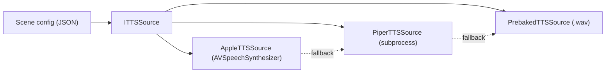
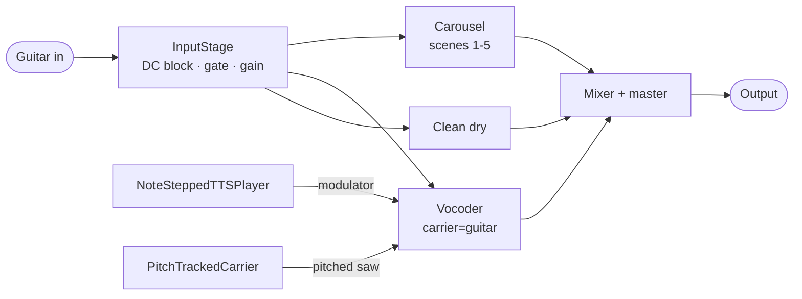

# While My Guitar Gently Speaks

Building a real-time talking, singing guitar — and what shipping for the stage taught me about building with AI

<div class="pt-12 opacity-75 text-lg">
AI Engineering Conference · San Francisco · 2026
</div>

<div class="pt-4 opacity-50 text-sm">
Todd Fisher
</div>

<!--
Hi, I'm Todd. For the next ~30 minutes I'm going to walk you through
a real-time audio project — a guitar that talks and sings — and the
five lessons it taught me about building with AI for environments
where you can't afford to crash.
-->

---
transition: fade-out
---

# What if your guitar could speak?

<v-clicks>

- Plug a guitar in
- Plug a foot controller in
- Step on a pedal
- Pluck a note → guitar says a word
- Pluck another → next word
- Hold a chord → the word *sings* the note you played

</v-clicks>

<!--
This is the demo. In the live talk, this is where the first audio
clip plays. Embed audio with: <audio src="/demo.wav" controls />
-->

---
layout: two-cols
class: gap-8
---

# The 15-minute demo arc

The architecture mirrors the show:

<v-clicks>

1. **Clean.** Establish dry guitar tone.
2. **Carousel.** Same riff, 5 timbres.
3. **The pivot.** *"What if it could speak?"*
4. **Whole-clip speech.** Pedal → guitar plays a full phrase.
5. **Note-triggered speech.** One pluck = one word.
6. **Pitched singing.** Carrier tracks your pitch.
7. **Sing mode.** Vibrato + chromatic snap.
8. **Panic.** Back to clean in ≤30 ms.

</v-clicks>

::right::

<div class="pt-8 opacity-75 text-sm">

Each pedal is a clear **before / after** the audience can hear.

The *evolution of the idea* lands as the show progresses, not in slides.

</div>

---
layout: section
---

# Part 1 — How a vocoder works

80-year-old phone tech, still magic

---

# Vocoder = "Voice Coder"

<div class="grid grid-cols-2 gap-8 pt-4">

<div>

**Modulator** (what shapes it)

```
   "hel-lo"  ━━━━━━━━━━━━━━━
            speech: TTS audio
   envelope: ▁▄█▆▂▁▃█▆▁
```

The modulator's **loudness over time** in each frequency band.

</div>

<div>

**Carrier** (what you hear)

```
   ♪♪♪♪♪♪♪♪♪  ━━━━━━━━━━━━━━━
              guitar audio
   timbre:    rich, harmonic
```

The carrier's **timbre** survives — but only where the modulator is loud.

</div>

</div>

<div v-click class="pt-8 text-center text-xl">

**Output:** a guitar shaped like a voice

</div>

<!--
Bell Labs, 1939. Originally for telephony bandwidth reduction.
Daft Punk made it a sound in pop culture. We use it to make a
guitar talk.
-->

---

# Channel vs FFT vocoder

<div class="grid grid-cols-2 gap-6 pt-4 text-sm">

<div>

## Channel (what we ship)

- 24 log-spaced bandpass filters
- Per-band envelope follower
- **Every input sample → output sample**
- Latency = filter group delay (~ms)
- Allocation-free, no block boundaries
- When it goes wrong, you can hear which band

</div>

<div>

## FFT / Phase

- Windowed FFT, overlap-add
- Higher fidelity in steady-state speech
- **Latency = window size (10–20 ms)**
- Block-based — more places to drop
- Failures are opaque

</div>

</div>

<div v-click class="pt-6 text-center opacity-75">

We pay fidelity to get latency, allocation-safety, and debuggability.<br/>
**Stability budget wins the trade.**

</div>

---
layout: section
---

# Part 2 — The stack

C++, JUCE, three TTS sources, one foot controller

---

# Why C++ + JUCE

<v-clicks>

- **JUCE has the most production miles in live audio.** "No allocations on the audio thread" is built into its idioms.
- **Plugin formats are free.** AUv2, VST3, AAX — same source.
- **Swift + AVAudioEngine?** Smaller live-audio track record.
- **Rust + cpal?** Real-time-safety story is younger; plugin formats aren't first-class.
- **Faust?** Great for DSP, awkward for the MIDI / state / GUI / I/O glue that this project is mostly made of.

</v-clicks>

---

# Three TTS sources behind one interface



<v-click>

**Defense in depth.** Any one can break on stage — a model file goes missing, a subprocess crashes, a voice gets uninstalled — and the show keeps going.

</v-click>

<v-click>

Per-scene JSON: `"fallback": "prebaked"`. Walk one hop on failure.

</v-click>

---

# The audio graph



<v-click>

**One wet branch per block, no overlap.** Carousel OR vocoder, never both.

</v-click>

<v-click>

**Audio thread:** zero allocations, zero locks, zero I/O.<br/>
**Message thread:** GUI, MIDI, scenes, asset load.<br/>
**Prewarm worker:** synthesizes live-TTS ahead of activation.

</v-click>

---
layout: section
---

# Part 3 — The evolution

Every interesting decision came from a bug

---

# v1: Instrument Carousel

Five pedal patches, hand-rolled DSP.

<div class="grid grid-cols-5 gap-3 pt-4 text-center text-sm">

<div class="p-3 border rounded">

**Choir**
multi-voice + vowel formant + reverb

</div>

<div class="p-3 border rounded">

**Distortion**
waveshaper + tone stack

</div>

<div class="p-3 border rounded">

**Piano**
octave + comb resonance

</div>

<div class="p-3 border rounded">

**8-bit**
crusher + downsample

</div>

<div class="p-3 border rounded">

**Auto-wah**
envelope-tracked SVF

</div>

</div>

<div v-click class="pt-8 text-sm opacity-75">

**Trade-off:** the "easy wins" came first. No pitch shift, no harmony, no formant — those were Phase 4b, the riskiest DSP under the latency budget.

</div>

---

# The pivot

<div class="text-3xl text-center pt-16 opacity-75">

Whole-clip speech is a punchline.

</div>

<div v-click class="text-3xl text-center pt-6">

It's funny once.

</div>

<div v-click class="text-3xl text-center pt-12">

What if the *player* paced the words?

</div>

---

# Note-triggered speech

```cpp
class NoteSteppedTTSPlayer {
    void onOnset() {
        wordIndex_++;
        segmentPlayPos_ = wordBoundaries_[wordIndex_].start;
    }

    float nextSample() {
        if (segmentPlayPos_ >= currentWord_.end)
            return 0.0f;  // silence between plucks
        return clip_[segmentPlayPos_++];
    }
};
```

<v-click>

Three new components:

- `OnsetDetector` — envelope follower with hysteresis on the *clean* signal
- `WordAligner` — energy-gap segmentation (no ML dependency)
- `NoteSteppedTTSPlayer` — per-onset state machine

</v-click>

<v-click>

Same algorithm for all three TTS backends. Float PCM in, word boundaries out.

</v-click>

---

# Bug 1: "I plucked one note, it said three words"

<v-clicks>

- A single hard pluck has a **noisy attack envelope** — crosses threshold 2–3 times in 30–50 ms
- The detector advanced the word index every time
- Even with perfect detection: fast playing **clips words mid-syllable**

</v-clicks>

<div v-click class="pt-8 opacity-75">

Two bugs hiding as one. Each needed its own fix.

</div>

---

# Fix 1: Word-sync modes

````md magic-move
```cpp
// before — every onset advances
void onOnset() {
    wordIndex_++;
    segmentPlayPos_ = wordBoundaries_[wordIndex_].start;
}
```

```cpp
// after — debounce + min-interval
void onOnset() {
    auto now = currentSampleTime();
    if (now - lastOnset_ < kMinIntervalSamples) return;  // 80 ms
    lastOnset_ = now;
    wordIndex_++;
    segmentPlayPos_ = wordBoundaries_[wordIndex_].start;
}
```

```cpp
// also: Latch mode — finish the word before advancing
void onOnset() {
    auto now = currentSampleTime();
    if (now - lastOnset_ < kMinIntervalSamples) return;
    if (mode_ == Mode::Latch && !segmentFinished()) return;
    lastOnset_ = now;
    wordIndex_++;
    segmentPlayPos_ = wordBoundaries_[wordIndex_].start;
}
```
````

<v-click>

Per-scene config picks the mode: `"wordSync": "latch" | "advance" | "syllable"`

</v-click>

---

# Bug 2: "Why does it sound atonal?"

<div class="pt-4">

A channel vocoder needs a carrier with harmonic content. v1's carrier was **guitar + broadband noise**.

The noise floor preserved sibilance — but the voice sounded **disconnected** from the chord you were playing.

</div>

<div v-click class="pt-6">

> *"It's like the voice has its own opinion about pitch."*

</div>

<div v-click class="pt-8">

**Fix:** detect the guitar's pitch, build a carrier that tracks it.

</div>

---

# Pitch-tracked carrier

````md magic-move
```cpp
// before — broadband noise carrier
float carrierSample(float guitar) {
    return guitar + noiseGen_.next() * floorAmount_;
}
```

```cpp
// after — pitched sawtooth carrier
float carrierSample(float guitar) {
    float f0  = yinDetector_.f0();          // ~30 ms latency, ~150 LOC
    float saw = polyBlepSaw_.tick(f0);       // anti-aliased, 30 LOC
    return guitar + saw * pitchedAmount_;
}
```
````

<div class="grid grid-cols-2 gap-6 pt-6 text-sm">

<div v-click>

**Why YIN over FFT pitch?**

Low-E fundamental (82 Hz) is often weaker than the 2nd harmonic. FFT/HPS octave-errors. YIN's normalized difference function handles it natively.

</div>

<div v-click>

**Why PolyBLEP over a naive saw?**

A naive digital saw aliases at high pitches → crackly buzz. PolyBLEP adds a tiny corrective polynomial at wrap — band-limited, allocation-free.

</div>

</div>

---

# Sing mode

Speaking-on-a-pitch isn't singing. Two small additions:

<v-clicks>

- **Vibrato** — 5 Hz sine LFO, ±20 cents
- **Chromatic snap** — quantize detected F0 to the nearest semitone *before* the saw consumes it

</v-clicks>

<div v-click class="pt-8 opacity-75">

**Order matters:** quantize first, then vibrato around the quantized tone.

</div>

<div v-click class="pt-4 opacity-75">

**No chord/scale quantize.** Chromatic is the safe default — you can't play a "wrong" note relative to *what you played*.

</div>

---

# v2: Phoneme-aligned (this week)

The v1 player splits syllables by equal subdivision. The next pluck after the *m* in "automatically" usually lands somewhere in the *l*.

<v-click>

**Pipeline:**

```
text → Piper                     (audio)
     → espeak-ng                 (phoneme labels)
     → Syllabifier               (sonority-peak grouping)
     → PhonemeSteppedTTSPlayer   (Attack / Sustain / Coda state machine)
```

</v-click>

<v-click class="pt-6">

**Vowel grain-loop sustain.** Hold the vowel under sustain by pitch-synchronous grain looping (~20–40 ms grains, PSOLA-style). On release: play out the consonant coda.

</v-click>

<v-click class="pt-4 opacity-75 text-sm">

Honest caveat: espeak-ng's `--pho` only emits durations for MBROLA voices. For standard voices we use labels only, rescale uniformly. Sonority boundaries are real; per-phoneme timing is still placeholder.

</v-click>

---

# v2 polish: cuts in the right place

<div class="grid grid-cols-2 gap-8 pt-2">
<div>

**The bug:** boundary lines were landing on the loud vowel peaks instead of in the quiet gaps between syllables. The cuts followed phoneme *indices*, not actual audio *energy*.

<v-click>

**Two-pass fix, runs on every Piper synthesis:**

1. **Refine the vowel nucleus.** For each syllable, scan its sample range for the local RMS *peak*. That's the real vowel center, regardless of what espeak guessed.

2. **Snap the boundary.** Between two flanking vowel nuclei, scan for the local RMS *minimum*. That's the silent gap between words. Move the boundary there.

</v-click>

<v-click class="pt-4 text-sm opacity-75">

A 5 ms safety margin from each nucleus keeps the cut away from the loudest formant content. After snapping, the per-syllable attack and coda anchors re-refine against the new bounds.

</v-click>

</div>
<div>

<svg viewBox="0 0 480 340" xmlns="http://www.w3.org/2000/svg" class="w-full">
  <!-- BEFORE panel -->
  <text x="20" y="20" font-size="13" fill="currentColor" opacity="0.7">Before</text>
  <text x="20" y="38" font-size="11" fill="#e76e6e">cuts on vowel peaks (wrong)</text>
  <line x1="20" y1="120" x2="460" y2="120" stroke="currentColor" stroke-width="0.5" stroke-dasharray="2,3" opacity="0.3"/>
  <path fill="#6cc89a" opacity="0.7" d="M 20 120 L 30 120 L 40 116.2 L 50 106.2 L 60 93.8 L 70 83.8 L 80 80 L 90 83.8 L 100 93.8 L 110 106.2 L 120 116.2 L 130 120 L 140 116.2 L 150 106.2 L 160 93.8 L 170 83.8 L 180 80 L 190 83.8 L 200 93.8 L 210 106.2 L 220 116.2 L 230 120 L 240 116.2 L 250 106.2 L 260 93.8 L 270 83.8 L 280 80 L 290 83.8 L 300 93.8 L 310 106.2 L 320 116.2 L 330 120 L 340 116.2 L 350 106.2 L 360 93.8 L 370 83.8 L 380 80 L 390 83.8 L 400 93.8 L 410 106.2 L 420 116.2 L 430 120 L 460 120 L 430 120 L 420 123.8 L 410 133.8 L 400 146.2 L 390 156.2 L 380 160 L 370 156.2 L 360 146.2 L 350 133.8 L 340 123.8 L 330 120 L 320 123.8 L 310 133.8 L 300 146.2 L 290 156.2 L 280 160 L 270 156.2 L 260 146.2 L 250 133.8 L 240 123.8 L 230 120 L 220 123.8 L 210 133.8 L 200 146.2 L 190 156.2 L 180 160 L 170 156.2 L 160 146.2 L 150 133.8 L 140 123.8 L 130 120 L 120 123.8 L 110 133.8 L 100 146.2 L 90 156.2 L 80 160 L 70 156.2 L 60 146.2 L 50 133.8 L 40 123.8 L 30 120 L 20 120 Z"/>
  <line x1="180" y1="55" x2="180" y2="180" stroke="#e76e6e" stroke-width="2.5"/>
  <line x1="280" y1="55" x2="280" y2="180" stroke="#e76e6e" stroke-width="2.5"/>
  <line x1="380" y1="55" x2="380" y2="180" stroke="#e76e6e" stroke-width="2.5"/>
  <!-- AFTER panel -->
  <text x="20" y="200" font-size="13" fill="currentColor" opacity="0.7">After</text>
  <text x="20" y="218" font-size="11" fill="#7ec87e">cuts in energy valleys (correct)</text>
  <line x1="20" y1="280" x2="460" y2="280" stroke="currentColor" stroke-width="0.5" stroke-dasharray="2,3" opacity="0.3"/>
  <path fill="#6cc89a" opacity="0.7" transform="translate(0, 160)" d="M 20 120 L 30 120 L 40 116.2 L 50 106.2 L 60 93.8 L 70 83.8 L 80 80 L 90 83.8 L 100 93.8 L 110 106.2 L 120 116.2 L 130 120 L 140 116.2 L 150 106.2 L 160 93.8 L 170 83.8 L 180 80 L 190 83.8 L 200 93.8 L 210 106.2 L 220 116.2 L 230 120 L 240 116.2 L 250 106.2 L 260 93.8 L 270 83.8 L 280 80 L 290 83.8 L 300 93.8 L 310 106.2 L 320 116.2 L 330 120 L 340 116.2 L 350 106.2 L 360 93.8 L 370 83.8 L 380 80 L 390 83.8 L 400 93.8 L 410 106.2 L 420 116.2 L 430 120 L 460 120 L 430 120 L 420 123.8 L 410 133.8 L 400 146.2 L 390 156.2 L 380 160 L 370 156.2 L 360 146.2 L 350 133.8 L 340 123.8 L 330 120 L 320 123.8 L 310 133.8 L 300 146.2 L 290 156.2 L 280 160 L 270 156.2 L 260 146.2 L 250 133.8 L 240 123.8 L 230 120 L 220 123.8 L 210 133.8 L 200 146.2 L 190 156.2 L 180 160 L 170 156.2 L 160 146.2 L 150 133.8 L 140 123.8 L 130 120 L 120 123.8 L 110 133.8 L 100 146.2 L 90 156.2 L 80 160 L 70 156.2 L 60 146.2 L 50 133.8 L 40 123.8 L 30 120 L 20 120 Z"/>
  <line x1="130" y1="215" x2="130" y2="340" stroke="#7ec87e" stroke-width="2.5"/>
  <line x1="230" y1="215" x2="230" y2="340" stroke="#7ec87e" stroke-width="2.5"/>
  <line x1="330" y1="215" x2="330" y2="340" stroke="#7ec87e" stroke-width="2.5"/>
</svg>

</div>
</div>

<!--
The user-reported screenshot showed the original bug clearly: vertical
boundary lines landed on top of the loud peaks (vowel centers) — exactly
where the cut shouldn't be. The two-pass anchor algorithm is the fix.
-->

---
layout: section
---

# Part 4 — Stability

"Cannot crash on stage" is the single load-bearing requirement

---

# What "cannot crash" actually meant

<v-clicks>

- **Zero allocations on the audio thread.** Ever. A test harness hooks `operator new` / `pthread_mutex_lock` and aborts on violation.
- **290+ tests.** Per-module unit, golden-file scene renders, integration, headless-safety. CI blocks on red.
- **`auval` + `pluginval` strictness-10** as gates *before* Logic ever sees a build.
- **Brick-wall limiter** at the carousel output. Filters self-oscillate; the PA + audience eardrums don't get the surprise.
- **Graceful degradation everywhere.** TTS fails → fallback. Piper missing → noise floor still works. AI times out → canned reply. FCB unplugged → keyboard shortcuts.

</v-clicks>

<div v-click class="pt-6 opacity-75 text-center">

Defense in depth, top to bottom.

</div>

---

# The visibility principle

Every internal decision the app makes should be **visible on stage**.

<div class="grid grid-cols-2 gap-4 pt-6 text-sm">

<div v-click class="p-3 border rounded">

**`DiagToggleBar`** — pills for V/N/Sib/P/M. Each lights when active. Keyboard shortcuts mirror them.

</div>

<div v-click class="p-3 border rounded">

**`NoteReadout`** — note + cents + Hz, live, 30 Hz refresh, *whether the toggle is on or off*.

</div>

<div v-click class="p-3 border rounded">

**`TtsStatusBar`** — Apple / Piper / Prebaked availability. "Fell back: piper → prebaked" when the chain walked.

</div>

<div v-click class="p-3 border rounded">

**`StatePill`** — `Idle / Capturing / Transcribing / Thinking / Speaking / Error` with reason text on errors.

</div>

</div>

<div v-click class="pt-6 opacity-75 text-center">

Free UX. Doubles as the demo's pedagogy.

</div>

---

# The AU plugin — Logic Pro

Originally an explicit non-goal. The standalone proved the dev loop in seconds-per-cycle; JUCE made the AU export almost-free.

<v-click>

**Why AUv2, not AUv3?**

- AUv2 loads **in-process** in Logic.
- That's exactly what lets `AVSpeechSynthesizer` and the Piper *subprocess* run inside the plugin.
- AUv3's sandbox would block both.

</v-click>

<v-click class="pt-4 opacity-75 text-sm">

**Cost:** a plugin crash takes Logic down with it. So: stabilize in standalone → `pluginval` strictness-10 → Logic. Three gates.

</v-click>

<v-click class="pt-4 opacity-50 text-xs">

macOS gotcha: after a plugin rename, `AudioComponentRegistrar` caches the old identity. `killall -9 AudioComponentRegistrar` and retry. Not your code.

</v-click>

---
layout: section
---

# Part 5 — Where it's going

Conversational AI, audience-text encore, neural vocoder

---

# Conversational AI

"Press a foot pedal, speak, the guitar replies."

```
PTT pedal ──► MicCapture            (sidechain bus or device input)
            ──► whisper.cpp         (local STT, ggml-base.en, ~150 MB)
            ──► ILlmClient          (Anthropic cloud OR Ollama local)
            ──► PersonaRegistry     (6 presets, editable system prompts)
            ──► enqueueSayText()
            ──► TTS → ChannelVocoder → guitar speaks
```

<v-click class="pt-4 text-sm">

**Local-default + cloud-fallback.** Ollama (llama3.2:3b) runs without an internet connection — a hotel-wifi-died demo still ships. Anthropic's Claude Haiku when latency wins over offline.

</v-click>

<v-click class="pt-4 text-sm opacity-75">

State machine, not a callback chain. Every error path returns to Idle with a visible reason without blocking the audio thread.

</v-click>

---

# What's still open

<v-clicks>

- **Phoneme-level alignment** — the most lyrically-impactful next thing
- **Polyphonic pitch tracking** — open research on guitar (sympathetic vibration, overlapping harmonics)
- **Neural vocoder** — `IVocoder` seam exists, ONNX Runtime + RVC could swap in
- **Audience-text encore** — embedded HTTP + QR code, audience submits a text, the guitar speaks it

</v-clicks>

---
layout: section
---

# Lessons for AI engineers

What translates from this project to yours

---

# Five lessons that translate

<v-clicks>

1. **Build for the stage even when there's no stage.** The "cannot crash" constraint forced every other good decision: fallbacks, RT-safe, visibility, defense in depth.

2. **Latency is a feature.** Not a thing you optimize later. A vocoder you can't hear yourself in is a different product.

3. **Local-first beats cloud-first when failure matters.** Hotel wifi dies. Models go down. Subprocesses crash. Run what you can locally; treat cloud as the *fallback*, not the default.

4. **Iterate where you can see the failure.** The standalone app was the dev loop; Logic was the milestone. Don't optimize for the deploy target — optimize for the *feedback speed*.

5. **Visibility is free UX.** Every internal toggle, every fallback walk, every detected pitch — surface it. The user (or the audience) sees what's happening.

</v-clicks>

---
layout: center
class: text-center
---

# Go build something for a stage

<div class="pt-8 text-xl opacity-75">

(or a venue, or a classroom, or a living room)

</div>

<div class="pt-12 opacity-50 text-sm">

The interesting thing isn't the model.<br/>
It's what you let the audience do with it.

</div>

---
layout: end
---

# Thanks

<div class="pt-8 text-lg">
Todd Fisher
</div>

<div class="pt-4 opacity-50 text-sm">
Questions?
</div>
