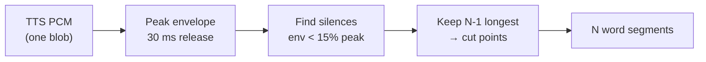

# While My Guitar Gently Speaks

<div class="flex gap-8 pt-12 items-center max-w-3xl mx-auto">

<div class="text-right w-full max-w-[457px]">
  <div class="text-4xl font-semibold">Todd Fisher</div>
  <div class="text-2xl opacity-75 pt-1">Head of Engineering · Philo Ventures</div>
  <div class="flex items-center justify-end gap-2 pt-3 text-lg opacity-80">
    <span>todd-b-fisher</span>
    <svg viewBox="0 0 24 24" class="w-5 h-5" fill="#4DA8F0"><path d="M20.45 20.45h-3.56v-5.57c0-1.33-.02-3.04-1.85-3.04-1.86 0-2.14 1.45-2.14 2.94v5.67H9.35V9h3.41v1.56h.05c.48-.9 1.64-1.85 3.37-1.85 3.6 0 4.27 2.37 4.27 5.46v6.28zM5.34 7.43a2.06 2.06 0 1 1 0-4.13 2.06 2.06 0 0 1 0 4.13zM7.12 20.45H3.56V9h3.56v11.45zM22.22 0H1.77C.79 0 0 .77 0 1.73v20.54C0 23.23.79 24 1.77 24h20.45c.98 0 1.78-.77 1.78-1.73V1.73C24 .77 23.2 0 22.22 0z"/></svg>
  </div>
</div>

<div class="pl-5">

</div>
</div>

<div class="flex justify-center pt-12">
  
</div>

<!--
Hi, I'm Todd Fisher, Head of Engineering at Philo Ventures. For
the next ~30 minutes I'm going to walk you through a real-time
audio project — a guitar that talks and sings — and what shipping
it for the stage taught me about building with AI.
-->

---
layout: center
class: text-center
---

# Live performances rock

<v-clicks>
<div>
Leverage technology in a creative way
</div>
</v-clicks>

<div class="absolute bottom-4 left-6 text-xs opacity-20">1m</div>

---
layout: center
class: text-center
---

<!-- # Remember those personal projects? -->

<div class="flex justify-center pt-6">
  
</div>

---

<div class="absolute inset-0 flex items-center justify-center p-6">
  
</div>

<!--
Walk the audience through the panels left → right:
1. Acoustic Scream — caveman with an acoustic. The starting point.
2. Electric Distortion — pickup + amp + dirt. The first big leap.
3. The Pedal Chain — fuzz, wah, delay; tone-shaping at the foot.
4. The Talkbox Voice — Peter Frampton, "Do You Feel Like We Do."
   First real "speaking" guitar. The mouth is the resonator.
5. Software Emulation — same effects, now in a plugin host.
6. AI Tools — synthesis + language generation. Where this talk lives.

Ebow gets a mention but isn't pictured; it's the side path.
-->

<div class="absolute bottom-4 left-6 text-xs opacity-30">1m</div>


---

<div class="absolute inset-0 flex items-center justify-center p-6">
  
</div>

<!--
Quick origin story. Every Halloween I had two choices: walk with
the kids or stay home. Found out you can crank a guitar amp loud
outside on Halloween and no one calls the cops. That's how this
whole thread started.
-->

---

<div class="absolute inset-0 flex items-center justify-center p-6">
  
</div>

---

<div class="absolute inset-0 flex items-center justify-center p-6">
  
</div>

<div class="absolute bottom-4 left-0 right-0 text-center text-sm opacity-80 z-10">
  <a
    href="https://www.activeviz.com/stranger-things-lights"
    target="_blank"
    rel="noopener noreferrer"
    class="hover:opacity-100"
  >
    activeviz.com/stranger-things-lights ↗
  </a>
</div>

<!--
One year I dressed as Eddie Munson from Stranger Things season 4.
Pause and read the room: "anyone here watch Stranger Things?"
That night, sitting on the porch in costume, I started asking:
what else could make this better?
-->

<div class="absolute bottom-4 left-6 text-xs opacity-30">3:30</div>


---

<div class="absolute inset-0 flex flex-col items-center justify-center text-center">
  <div class="text-5xl">What if my guitar could</div>
  <div class="text-9xl font-bold pt-6">speak?</div>
</div>

<!--
The pivot question. Pause after "speak" — let it land.
This is the setup for the demo.
-->

---
transition: fade-out
---

# Tools for the job

- **JUCE has the most production miles in live audio.** 
  "No allocations on the audio thread" is built into its idioms. C++ FTW!
- **Plugin formats are free.** AUv2, VST3, AAX — same source.
- **TTS** — Piper (local neural), Apple AVSpeechSynthesizer, prebaked WAV.
- **DSP** — 24-band channel vocoder, YIN pitch detection, PolyBLEP saw.

---
layout: center
---

# Goal: Guitar triggers saying a word

<div class="flex flex-col items-center gap-3 pt-6">

<div class="relative border border-gray-600 rounded-xl px-10 pt-7 pb-6">
  <div class="absolute -top-3 left-5 px-2 text-xs tracking-wide opacity-60 bg-black">Offline / bake this once</div>
  <div class="flex items-center gap-3">
    <div class="rounded-md px-5 py-3 font-medium" style="background:#e0f2fe;color:#0c4a6e">Raw text</div>
    <div class="text-2xl opacity-40">→</div>
    <div class="rounded-md px-5 py-3 font-medium" style="background:#cffafe;color:#164e63">TTS</div>
    <div class="text-2xl opacity-40">→</div>
    <div class="rounded-md px-5 py-3 font-medium" style="background:#ccfbf1;color:#134e4a">Audio clip</div>
  </div>
</div>

<div class="flex flex-col items-center gap-1" style="transform: translateX(80px)">
  <div class="text-2xl opacity-40 leading-none self-start pl-8">↓</div>
</div>

<div class="relative border border-gray-600 rounded-xl px-10 pt-7 pb-6">
  <div class="absolute -top-3 left-5 px-2 text-xs tracking-wide opacity-60 bg-black">Live / repeat per pluck</div>
  <div class="flex items-center gap-3">
    <div class="rounded-full px-5 py-3 font-medium" style="background:#fef9c3;color:#713f12">Guitar pluck</div>
    <div class="text-2xl opacity-40">→</div>
    <div class="rounded-md px-5 py-3 font-medium" style="background:#ffedd5;color:#7c2d12">Play audio clip</div>
    <div class="text-2xl opacity-40">→</div>
    <div class="rounded-full w-12 h-12 flex items-center justify-center text-xl" style="background:#fee2e2;color:#7f1d1d">🔊</div>
  </div>
</div>

</div>

<div class="absolute bottom-4 left-6 text-xs opacity-30">Scene 1</div>

---
layout: center
---

# Goal: Say multiple words {.text-center}

<div class="flex flex-col items-center gap-3 pt-6">

<div class="relative border border-gray-600 rounded-xl px-10 pt-7 pb-6">
  <div class="absolute -top-3 left-5 px-2 text-xs tracking-wide opacity-60 bg-black">Offline / bake this once</div>
  <div class="flex items-center gap-3">
    <div class="rounded-md px-5 py-3 font-medium" style="background:#e0f2fe;color:#0c4a6e">Raw text</div>
    <div class="text-2xl opacity-40">→</div>
    <div class="rounded-md px-5 py-3 font-medium" style="background:#cffafe;color:#164e63">TTS</div>
    <div class="text-2xl opacity-40">→</div>
    <div class="rounded-md px-5 py-3 font-medium" style="background:#ccfbf1;color:#134e4a">Audio clip</div>
  </div>
</div>

<div class="flex flex-col items-center gap-1" style="transform: translateX(80px)">
  <div class="text-2xl opacity-40 leading-none self-end pr-9">↓</div>
  <div class="rounded-md px-5 py-3 font-medium" style="background:#dcfce7;color:#14532d">Slice per word</div>
  <div class="text-2xl opacity-40 leading-none self-start pl-8">↓</div>
</div>

<div class="relative border border-gray-600 rounded-xl px-10 pt-7 pb-6">
  <div class="absolute -top-3 left-5 px-2 text-xs tracking-wide opacity-60 bg-black">Live / repeat per pluck</div>
  <div class="flex items-center gap-3">
    <div class="rounded-full px-5 py-3 font-medium" style="background:#fef9c3;color:#713f12">Guitar pluck</div>
    <div class="text-2xl opacity-40">→</div>
    <div class="rounded-md px-5 py-3 font-medium" style="background:#ffedd5;color:#7c2d12">Play next word</div>
    <div class="text-2xl opacity-40">→</div>
    <div class="rounded-full w-12 h-12 flex items-center justify-center text-xl" style="background:#fee2e2;color:#7f1d1d">🔊</div>
  </div>
</div>

</div>

<div class="absolute bottom-4 left-6 text-xs opacity-30">Scene 2</div>

---

# Auto slice the audio clip

We get one blob of PCM back from TTS — no timestamps. To play one word per pluck, we have to find the cuts ourselves. (`Enter: WordAligner`)



<div
  v-motion
  :initial="{ opacity: 0, y: 12 }"
  :enter="{ opacity: 1, y: 0, transition: { delay: 4000, duration: 600 } }"
  class="text-center text-4xl font-semibold pt-8"
>💡 Energy-gap segmentation</div>

<div class="absolute bottom-4 left-6 text-xs opacity-30">Scene 0</div>

<!--
The TTS engines hand back raw PCM with no word boundaries. Rather
than ask each engine for timing (Apple won't, Piper won't, the
prebaked WAV can't), I slice uniformly off the audio itself in
WordAligner::align. Build a smoothed peak envelope (instant attack,
~30 ms exponential release), threshold at 15% of the clip peak,
collect the silence runs, keep the N-1 longest as boundaries, and
cut. The 30 ms release is deliberately longer than stop-consonant
gaps inside a word so those don't register as boundaries. Because
it only touches the PCM + the word list, the exact same code works
for all three TTS sources — that's the whole point.
-->

---

# Syllables are tricky!

- **Phoneme alignment** — espeak-ng labels + sonority-peak syllabifier
- espeak gives the **sounds**, but not the **when** — uniform fake durations, so we still have to guess each syllable's position from the audio

<div class="flex justify-center pt-4">
  
</div>

<!-- ---

<div class="absolute inset-0 flex items-center justify-center p-6">
  
</div> -->

---
layout: section
---

<div class="absolute inset-0 flex flex-col items-center justify-center text-center">
  <div class="text-5xl">What if my guitar could</div>
  <div class="text-9xl font-bold pt-6 pb-10">sing?</div>
  <div class="text-2xl">
Next Stop: Pitch detection.
</div>
</div>

---

<div class="absolute inset-0 flex items-center justify-center p-6">
  
</div>

---
layout: center
class: text-center
---

<!-- # Finding the fundamental -->

<!-- <div class="grid grid-cols-[1.05fr_1fr] gap-8 pt-2 text-sm"> -->

<!-- <div>

A guitar note is **rich and harmonic** — naive autocorrelation keeps locking onto the wrong octave. **YIN** (de Cheveigné & Kawahara, 2002) fixes that in four steps:

1. **Difference function** — slide the signal against a delayed copy of itself: `d(τ) = Σ (x[j] − x[j+τ])²`. It dips toward zero when the lag `τ` matches the period.
2. **Cumulative mean normalize (CMNDF)** — divide by the running average so tiny lags stop always winning. This is the step that kills octave errors.
3. **Absolute threshold** — take the *first* dip below `0.15`, not the global minimum. That lag is the period `τ`.
4. **Parabolic interpolation** — refine `τ` between samples for sub-Hz precision.

<div class="pt-2 opacity-75">

`f₀ = sampleRate / τ` — clamped to 40–2000 Hz. Nothing below threshold ⇒ **unvoiced**.

</div>

</div> -->

<div class="flex items-center justify-center pt-4">
  
</div>

<!-- </div> -->

<!-- <div class="absolute bottom-4 left-6 right-6 text-xs opacity-50">

**Why YIN over a plain FFT?** It runs sample-by-sample with no block latency, stays allocation-free on the audio thread, and the CMNDF step makes it far more robust to octave errors on a harmonically-rich guitar than peak-picking an FFT or raw autocorrelation.

</div> -->

<!--
This is the "how do we know what note you're playing" slide.
Key intuition for steps 1-2: the difference function finds repeats,
but it trivially dips at tiny lags too — the cumulative-mean
normalization is what stops it from snapping an octave (or two) high.
Threshold + parabolic interp are just "pick the right dip" and
"get the decimal places." The output f0 drives the pitched saw
carrier the vocoder shapes — that's how a spoken word comes out *sung*.
Real params live in PitchTrackedCarrier: 2048-sample window,
256-sample hop, threshold 0.15, 40-2000 Hz range.
-->

---
layout: center
---

# The vocoder marries pitch + voice

<div class="flex items-center justify-center gap-4 pt-6 text-sm">
<div class="flex flex-col gap-5">
<div class="relative border border-gray-600 rounded-xl px-6 pt-6 pb-4">
<div class="absolute -top-3 left-5 px-2 text-xs tracking-wide opacity-60 bg-black">Carrier = pitch</div>
<div class="flex items-center gap-2">
<div class="rounded-full px-3 py-2 font-medium" style="background:#fef9c3;color:#713f12">🎸 Guitar</div>
<div class="text-lg opacity-40">→</div>
<div class="rounded-md px-3 py-2 font-medium" style="background:#dbeafe;color:#1e3a8a">YIN&nbsp;f₀</div>
<div class="text-lg opacity-40">→</div>
<div class="rounded-md px-3 py-2 font-medium" style="background:#ccfbf1;color:#134e4a">Pitched saw</div>
</div>
</div>
<div class="relative border border-gray-600 rounded-xl px-6 pt-6 pb-4">
<div class="absolute -top-3 left-5 px-2 text-xs tracking-wide opacity-60 bg-black">Modulator = words</div>
<div class="flex items-center gap-2">
<div class="rounded-md px-3 py-2 font-medium" style="background:#ffedd5;color:#7c2d12">🗣 Voice clip</div>
<div class="text-xs opacity-60">one spoken word</div>
</div>
</div>
</div>
<div class="flex flex-col justify-between self-stretch py-5 text-3xl opacity-40"><div>→</div><div>→</div></div>
<div class="rounded-xl px-6 py-5 text-center" style="background:#ede9fe;color:#5b21b6">
<div class="font-semibold text-base">24-band vocoder</div>
<div class="flex items-end justify-center gap-1 h-12 py-2">
<div class="w-1.5 rounded-t" style="height:40%;background:#7c3aed"></div>
<div class="w-1.5 rounded-t" style="height:75%;background:#7c3aed"></div>
<div class="w-1.5 rounded-t" style="height:55%;background:#7c3aed"></div>
<div class="w-1.5 rounded-t" style="height:95%;background:#7c3aed"></div>
<div class="w-1.5 rounded-t" style="height:60%;background:#7c3aed"></div>
<div class="w-1.5 rounded-t" style="height:80%;background:#7c3aed"></div>
<div class="w-1.5 rounded-t" style="height:45%;background:#7c3aed"></div>
<div class="w-1.5 rounded-t" style="height:70%;background:#7c3aed"></div>
</div>
<div class="text-xs opacity-80">carrier bands × voice envelopes</div>
</div>
<div class="text-3xl opacity-40">→</div>
<div class="rounded-xl px-5 py-4 text-center font-medium" style="background:#fee2e2;color:#7f1d1d">🔊<br/>word, <i>sung</i><br/>at your pitch</div>
</div>

<div class="text-center text-xl pt-6">It's not a blender — it's a <b>stencil</b>. The voice is the <b>shape</b>; your guitar is the <b>paint</b>.</div>

<v-click>
<div class="flex flex-col items-center pt-6">
<div class="text-xs opacity-60 pb-2">…or: the voice works a 24-band EQ on your guitar, hundreds of times a second</div>
<div class="flex items-end gap-2 px-4 py-3 rounded-lg border border-gray-700">
<div class="relative w-4 h-16"><div class="absolute left-1/2 top-0 bottom-0 w-px bg-gray-600"></div><div class="absolute left-0 right-0 h-1.5 rounded bg-sky-400" style="top:62%"></div></div>
<div class="relative w-4 h-16"><div class="absolute left-1/2 top-0 bottom-0 w-px bg-gray-600"></div><div class="absolute left-0 right-0 h-1.5 rounded bg-sky-400" style="top:30%"></div></div>
<div class="relative w-4 h-16"><div class="absolute left-1/2 top-0 bottom-0 w-px bg-gray-600"></div><div class="absolute left-0 right-0 h-1.5 rounded bg-sky-400" style="top:48%"></div></div>
<div class="relative w-4 h-16"><div class="absolute left-1/2 top-0 bottom-0 w-px bg-gray-600"></div><div class="absolute left-0 right-0 h-1.5 rounded bg-sky-400" style="top:12%"></div></div>
<div class="relative w-4 h-16"><div class="absolute left-1/2 top-0 bottom-0 w-px bg-gray-600"></div><div class="absolute left-0 right-0 h-1.5 rounded bg-sky-400" style="top:35%"></div></div>
<div class="relative w-4 h-16"><div class="absolute left-1/2 top-0 bottom-0 w-px bg-gray-600"></div><div class="absolute left-0 right-0 h-1.5 rounded bg-sky-400" style="top:55%"></div></div>
<div class="relative w-4 h-16"><div class="absolute left-1/2 top-0 bottom-0 w-px bg-gray-600"></div><div class="absolute left-0 right-0 h-1.5 rounded bg-sky-400" style="top:25%"></div></div>
<div class="relative w-4 h-16"><div class="absolute left-1/2 top-0 bottom-0 w-px bg-gray-600"></div><div class="absolute left-0 right-0 h-1.5 rounded bg-sky-400" style="top:42%"></div></div>
<div class="relative w-4 h-16"><div class="absolute left-1/2 top-0 bottom-0 w-px bg-gray-600"></div><div class="absolute left-0 right-0 h-1.5 rounded bg-sky-400" style="top:68%"></div></div>
<div class="relative w-4 h-16"><div class="absolute left-1/2 top-0 bottom-0 w-px bg-gray-600"></div><div class="absolute left-0 right-0 h-1.5 rounded bg-sky-400" style="top:38%"></div></div>
<div class="relative w-4 h-16"><div class="absolute left-1/2 top-0 bottom-0 w-px bg-gray-600"></div><div class="absolute left-0 right-0 h-1.5 rounded bg-sky-400" style="top:58%"></div></div>
<div class="relative w-4 h-16"><div class="absolute left-1/2 top-0 bottom-0 w-px bg-gray-600"></div><div class="absolute left-0 right-0 h-1.5 rounded bg-sky-400" style="top:78%"></div></div>
</div>
</div>
</v-click>

<div class="absolute bottom-4 left-0 right-0 text-center text-xs opacity-50"><b>ADSR</b> — Attack · Decay · Sustain · Release</div>

<!-- Pitched saw = a synthetic sawtooth oscillator we generate at the guitar's detected pitch. We keep the pitch of your note and throw away its sound, replacing it with a clean, harmonically-rich tone — the perfect raw material for the vocoder to shape into words.

So when you talk to it: it's "YIN tells us what note you played; we rebuild that note as a clean synthesized sawtooth — all harmonics, perfectly in tune — and that's what the vocoder turns into speech." -->

---
layout: center
class: text-center
---

# Time to jam ... {.text-9xl}

<div class="absolute bottom-4 left-6 text-xs opacity-30">Scene 10</div>

---

# Conversations are a two way street

- **STT** — whisper.cpp (local, ~150 MB model, runs on CPU)
- **LLM** — Ollama (local models)

<div class="flex flex-col items-center gap-2 pt-4 text-sm">

<div class="relative border border-gray-600 rounded-xl px-8 pt-6 pb-5">
  <div class="absolute -top-3 left-5 px-2 text-xs tracking-wide opacity-60 bg-black">You speak</div>
  <div class="flex items-center gap-3">
    <div class="rounded-full w-11 h-11 flex items-center justify-center text-lg" style="background:#e0f2fe;color:#0c4a6e">🎤</div>
    <div class="text-xl opacity-40">→</div>
    <div class="rounded-md px-4 py-2 font-medium" style="background:#dbeafe;color:#1e3a8a">STT</div>
    <div class="text-xl opacity-40">→</div>
    <div class="rounded-md px-4 py-2 font-medium" style="background:#e0f2fe;color:#0c4a6e">Raw text</div>
  </div>
</div>

<div class="text-xl opacity-40 leading-none">↓</div>

<div class="relative border border-gray-600 rounded-xl px-8 pt-6 pb-5">
  <div class="absolute -top-3 left-5 px-2 text-xs tracking-wide opacity-60 bg-black">It thinks</div>
  <div class="flex items-center gap-3">
    <div class="rounded-md px-4 py-2 font-medium" style="background:#ede9fe;color:#5b21b6">Local LLM</div>
    <div class="text-xl opacity-40">→</div>
    <div class="rounded-md px-4 py-2 font-medium" style="background:#f3e8ff;color:#6b21a8">Response text</div>
  </div>
</div>

<div class="text-xl opacity-40 leading-none">↓</div>

<div class="relative border border-gray-600 rounded-xl px-8 pt-6 pb-5">
  <div class="absolute -top-3 left-5 px-2 text-xs tracking-wide opacity-60 bg-black">It speaks</div>
  <div class="flex items-center gap-3">
    <div class="rounded-md px-4 py-2 font-medium" style="background:#cffafe;color:#164e63">TTS</div>
    <div class="text-xl opacity-40">→</div>
    <div class="rounded-md px-4 py-2 font-medium" style="background:#dcfce7;color:#14532d">Slice per word</div>
    <div class="text-xl opacity-40">→</div>
    <div class="rounded-full px-4 py-2 font-medium" style="background:#fef9c3;color:#713f12">Guitar pluck</div>
    <div class="text-xl opacity-40">→</div>
    <div class="rounded-full w-11 h-11 flex items-center justify-center text-lg" style="background:#fee2e2;color:#7f1d1d">🔊</div>
  </div>
</div>

<div class="text-xs opacity-60 pt-1">↺ your reply starts the next turn</div>

</div>


<div class="absolute bottom-4 left-6 text-xs opacity-30">Scene 4</div>

---
layout: section
---

<div class="absolute inset-0 flex flex-col items-center justify-center text-center">
  <div class="text-5xl">What if my guitar could</div>
  <div class="text-7xl font-bold pt-6 pb-10">REALLY sing?</div>
  <div class="text-2xl">
</div>
</div>

---

# VocalSet: real singers, free to use

The university-academic version of "we have a vocal sample pack."

- **VocalSet** (Wilkins et al., ISMIR 2018) — 10 hours of professional vocalists, sung vowels at controlled techniques, CC-BY-4.0
- 20 singers, all 5 vowels, recorded in a controlled studio
- Curated a handful into the app and cut each recording into **grains** — short audio fragments, each a single sung note about a second long
- A bundle of grains becomes the source of truth for "what the guitar should sound like when you play this string"

<div class="pt-6 opacity-75 text-sm text-center">

</div>

<!--
The instant you say "use a real human voice instead of TTS," the
first question is where the audio comes from. Recording it yourself
is hours of studio time. Buying a sample pack is licensing
headaches. VocalSet is an academic dataset — professional singers,
controlled conditions, Creative Commons. I grabbed a few singers,
cut their recordings into short fragments — what we'll call grains
— a handful per voice, each a single sung note. The bundle of
grains is the raw material for everything downstream.
-->

---

# WORLD: pitch-shift without the chipmunk

**WORLD** is an open-source analysis/synthesis vocoder — it takes a recording of a singer and **changes the pitch while keeping the vowel**.

<div class="pt-4 text-sm opacity-90">

A VocalSet grain might be someone singing **"ah" at 250 Hz**. Your guitar plucks **82 Hz**. Naive pitch-shifting sounds like Alvin. WORLD avoids that.

</div>

<div class="flex items-center justify-center gap-3 pt-8 text-sm flex-wrap">
<div class="rounded-md px-4 py-3 font-medium" style="background:#ffedd5;color:#7c2d12">🎤 Singer grain</div>
<div class="text-xl opacity-40">→</div>
<div class="rounded-md px-4 py-3 font-medium" style="background:#ede9fe;color:#5b21b6">Split into 3 parts</div>
<div class="text-xl opacity-40">→</div>
<div class="rounded-md px-4 py-3 font-medium" style="background:#dbeafe;color:#1e3a8a">Shift pitch only</div>
<div class="text-xl opacity-40">→</div>
<div class="rounded-md px-4 py-3 font-medium" style="background:#dcfce7;color:#14532d">Resynthesize</div>
<div class="text-xl opacity-40">→</div>
<div class="rounded-md px-4 py-3 font-medium" style="background:#fee2e2;color:#7f1d1d">Same singer, your note</div>
</div>

<div class="grid grid-cols-3 gap-4 pt-8 text-xs text-center">
<div class="p-3 border border-gray-600 rounded-lg"><b>F0</b><br/>pitch</div>
<div class="p-3 border border-gray-600 rounded-lg"><b>Envelope</b><br/>vowel / formants</div>
<div class="p-3 border border-gray-600 rounded-lg"><b>Aperiodicity</b><br/>breath &amp; noise</div>
</div>

<div class="pt-6 opacity-75 text-sm text-center">

Shift **F0**. Leave envelope and aperiodicity alone. The vowel still sounds like that singer's **"ah"** — just at your guitar's pitch.

</div>

<!--
WORLD (Morise et al.) is a vocoder in the DSP sense — analysis/
synthesis — not the talking-guitar vocoder from earlier. It
decomposes a grain into F0 (pitch), spectral envelope (formants
that define the vowel), and aperiodicity (breath/noise). To
pitch-shift without chipmunking, scale only F0 and resynthesize.
Output is the real recorded voice, transposed — no saw carrier, no
24-band stamp. Next slide: why that resynthesis step is expensive
enough to pre-render offline.
-->

---

# This is a heavy process

WORLD works — but **not on the audio thread, not per pluck.** Some steps are fine offline once; **Synthesis** is the killer.

<div class="pt-3 grid grid-cols-2 gap-6 text-sm">

<div>

**1. Analyze the grain** *(offline, once per grain — OK)*

```
                ┌─ F0 contour    (Harvest)
   grain.wav  ──┼─ spectral env  (CheapTrick)
                └─ aperiodicity  (D4C)
```

~1 s of compute per grain. Also **allocates heap** — fatal on the real-time audio thread.

</div>

<div>

**2. Resynthesize at each target pitch** *(heavy — pre-bake)*

```
  scaled_F0  ─┐
  envelope   ─┼─ Synthesis ─→ shifted audio
  aperiod    ─┘
                      ↑
                 🔥 ~1 s each
```

Scale F0, leave envelope + aperiodicity alone. **This step is what we cannot run live.**

</div>

</div>

<div class="absolute bottom-4 left-6 text-xs opacity-30">Scene 12</div>

<!--
A grain is a short recording — someone singing the vowel "ah" at,
say, 250 Hz, for about a second. Your guitar might be plucking 82
Hz. We need to play that grain at the guitar's pitch without it
sounding like Alvin and the Chipmunks. WORLD is a library that does
this: it decomposes the recording into three independent streams.
Pitch — the F0 contour. Spectral envelope — the formants that make
"ah" sound like "ah" instead of "ee." And aperiodicity — the
breath and noise. Three streams. To shift the pitch, we scale ONLY
the F0 contour, leave the envelope and aperiodicity untouched, and
ask WORLD to re-synthesize. The vowel still sounds like that
singer's "ah," but the pitch matches the guitar. The catch is that
Synthesis is the expensive step, and we want to support every guitar
note from low E to high E. So we pre-render every pitch we might
need — 37 of them, every semitone in a three-octave range — for
every grain in the bundle. Twenty grains times 37 ratios times a
second of compute per ratio. A few minutes per voice. Once.
-->

<!-- ---

# Things we had to adjust to make it work on stage

The interesting bugs, in the order they bit.

- **WORLD allocates heap on every call.** Fatal on the audio thread. So we run it offline at activation time and the audio thread just picks the nearest pre-rendered buffer. Continuous portamento becomes nearest-semitone snap — fine for fretted instruments.

- **The first scene activation froze the app for 90 seconds** doing all that pre-rendering. Moved it to a background thread with a live "Loading vocals..." progress label.

- **Bake-once, load-many.** Persist the pre-render to disk, keyed by a hash of the source audio. First time per voice: ~5 minutes. Every time after: instant. Reinstall the app, the cache survives.

- **Notes kept singing forever** after you stopped playing — the grain ran out its full length regardless of your guitar. Added an amplitude envelope on the guitar input that gates the output when the string goes quiet. "Stop playing" actually stops now.

- **"Three octaves up, same note coming out."** Two compounding causes: pitch detection wasn't even running for the direct-shift path (it lived inside the vocoder branch). And the source slices were each 4 seconds long — long enough to contain two of the singer's scale notes, so a single strum played a rising line. Both fixed. -->

<!--
This is where the engineering got interesting. WORLD allocates heap
memory inside its synthesis call, which means we can't call it on
the audio thread — that's a hard no for real-time. So we pre-render
everything offline. Pre-rendering took ninety seconds and froze the
app, so we moved it to a background thread. It still takes minutes
on first activation, so we cache the result to disk keyed by a
content hash. Reinstall the app — cache survives. The notes kept
ringing forever because we weren't gating output on guitar input
amplitude — added that. The "same note across three octaves" bug
had TWO causes: pitch detection lived inside the vocoder branch
(didn't run for the shifter path), AND the source slices were long
enough to contain multiple sung notes. Each one took an afternoon
to find. The fixes are short. The finding-them part is the cost.
-->

---
layout: center
class: text-center
---

# Where to go from here?

---
layout: center
class: text-center
---


<div class="text-8xl pt-6 ">Thank you!</div>

<div class="flex justify-center pt-12">
  <a href="https://www.linkedin.com/in/todd-b-fisher" target="_blank"
     class="flex items-center gap-4 px-8 py-4 rounded-2xl border border-gray-600 hover:border-sky-400 transition-colors !no-underline"
     style="color:inherit">
    <svg viewBox="0 0 24 24" class="w-10 h-10" fill="#4DA8F0"><path d="M20.45 20.45h-3.56v-5.57c0-1.33-.02-3.04-1.85-3.04-1.86 0-2.14 1.45-2.14 2.94v5.67H9.35V9h3.41v1.56h.05c.48-.9 1.64-1.85 3.37-1.85 3.6 0 4.27 2.37 4.27 5.46v6.28zM5.34 7.43a2.06 2.06 0 1 1 0-4.13 2.06 2.06 0 0 1 0 4.13zM7.12 20.45H3.56V9h3.56v11.45zM22.22 0H1.77C.79 0 0 .77 0 1.73v20.54C0 23.23.79 24 1.77 24h20.45c.98 0 1.78-.77 1.78-1.73V1.73C24 .77 23.2 0 22.22 0z"/></svg>
    <span class="text-2xl tracking-wide">todd-b-fisher</span>
  </a>
</div>

